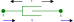

# Lecture 1: Introduction to acausal modeling for physical systems with ModelingToolkit.jl

## Background
### Julia
This course will use Julia as the fundamental tool to solve numerical problems.  ModelingToolkit.jl is a package writen in pure Julia and leverages the fundamental technologies of symbolic math from Symbolics.jl, numerical solvers from DifferentialEquations.jl, and automatic differentiation from ForwardDiff.jl.  To demonstrate an introduction to these technologeies, lets focus on one of the most fundamental engineering problems: the mass-spring-damper.  For now, let's leave the mass out of the system to avoid the 2nd derivative term and assume a non-linear spring ($k \cdot x^{1.5}$)


This system can be represented by the ordinary differential equation (ODE):

$d \cdot \dot{x} + k \cdot x^{1.5} = F$

To solve this in Julia we can apply finite differencing $\dot{x}_i = \frac{x_i - x_{i-1}}{\Delta t}$ and [Newton's method](https://en.wikipedia.org/wiki/Newton%27s_method).  Here we solve for the first time step...

```@example l1
using ForwardDiff
using Plots

d=1
k=1000
Δt=1e-3
F = 100

function f(xᵢ, xᵢ₋₁)

    ẋᵢ = (xᵢ - xᵢ₋₁)/Δt
    lhs = d*ẋᵢ + k*xᵢ^1.5
    rhs = F

    return lhs - rhs
end

# Newton's Method
# first time step (i=2)
xᵢ₋₁ = 0.0
xᵢ = xᵢ₋₁ #<-- guess
g(xᵢ) = f(xᵢ, xᵢ₋₁)
xᵢ -= g(xᵢ)/ForwardDiff.derivative(g, xᵢ)
xᵢ -= g(xᵢ)/ForwardDiff.derivative(g, xᵢ)
xᵢ -= g(xᵢ)/ForwardDiff.derivative(g, xᵢ)
```

Note that we can get the derivative for `f` from automatic differentiation using `ForwardDiff.derivative` (or using `ForwardDiff.jacobian` for a system of equations).  To solve for a series of time steps, we can simply update `x` and run again for each time step `Δt`.  This is a simple form of the Implicit/Backwards Euler method.

```@example l1
tol = 1e-3
x = zeros(10)
for i=2:10
    g(xᵢ) = f(xᵢ, x[i-1])
    Δx = Inf
    while abs(Δx) > tol
        Δx = g(x[i])/ForwardDiff.derivative(g, x[i]) 
        x[i] -= Δx
    end
end

plot(x; ylabel="x [m]", xlabel="time step")
```


### DifferentialEquations.jl
For this simple problem it's easy enough to implement the Newton method and solve directly, however it's possible to instead use the solvers from DifferentialEquations.jl.  To do this, we simply need to defined a `NonlinearProblem` by supplying the function `f` of the form $f(u,p)$ where:

- $u$ is the variable (scalar or vector)
- $p$ is the parameters (scalar or vector)

In this case $u$ and $p$ corespond to `xᵢ` and `xᵢ₋₁`, respectfully.  This is refered to as the "out-of-place" form, where each call to `f` allocates, it is also possible to define $f(du,u,p)$ as "in-place" form that gives $du$ as a pre-allocated memory space to mutate.  

Then we can solve by specifying the method, in this case we specify `NewtonRaphson` to implement Newton's method.

```@example l1
using DifferentialEquations

prob = NonlinearProblem(f, 0.0, 0.0)
sol=solve(prob, NewtonRaphson(); abstol=tol)
```

Note:  we get exactly the same result for the first time step.

To solve for a series of time steps, we can now use the `remake` function to update the initial guess `u0` and parameter `p` and generate and updated `NonlinearProblem` efficiently.

```@example l1
x = zeros(10)
for i=2:10
    prob′ = remake(prob; u0=x[i], p=x[i-1])
    sol = solve(prob′, NewtonRaphson(); abstol=tol)
    x[i] = sol[]
end
plot(x; ylabel="x [m]", xlabel="time step")
```

This approach requires the use of finite differencing and building a solution vector of solves for each time step, which was done only for demonstration purposes.  Since this problem is an ODE, it can and should be solved directly with an ODE solver.  To do this with DifferentialEquations.jl, we simply re-arrange the equation in the form $\frac{\partial u}{\partial t} = f(u,p,t)$.  In this case we have

$\dot{x}= \frac{F - k \cdot x^{1.5}}{d}$

```@example l1
function du_dt(u,p,t)
    F, k, d = p
    x = u
    return (F - k*x^1.5)/d
end

prob = ODEProblem(du_dt, 0.0, (0.0, 0.01), [F, k, d])
sol = solve(prob)
plot(sol; xlabel="time [s]", ylabel="x [m]")
```

In some cases, it may not be so easy to rearrange the equations in such a way to provide an ODE form.  We can also solve the problem in another way: Differential Algebraic Equations (DAE) form.  Here we have a mix of differential and algebraic equations.  A mass matrix is used to specify which equations are differential vs. algebraic.  Note that we are now solving for both $x$ and $\dot{x}$ and therefore need to supply initial conditions for each.  To satisfy the system at time 0 with $x=0$, we can see that $\dot{x} = \frac{F}{d}$.  


```@example l1
function du_dt(u,p,t)
    F, k, d = p
    x, ẋ = u
    
    eqs = [
        ẋ                       # D(x) = ẋ
        (d*ẋ + k*x^1.5) - (F)   #    0 = ( lhs ) - ( rhs )
    ]

    return eqs
end

fmm = ODEFunction(du_dt; mass_matrix=[1 0; 0 0])
prob = ODEProblem(fmm, [0.0, F/d], (0.0, 0.01), [F, k, d])
sol = solve(prob)
plot(sol; idxs=1, xlabel="time [s]", ylabel="x [m]")
```

Now, maybe we would like to know the 2nd derivative of $x$.  It should be easy enough to simply provide this in our function and solve.

```@example l1
function du_dt(u,p,t)
    F, k, d = p
    x, ẋ, ẍ = u
    
    eqs = [
        ẋ                       # D(x) = ẋ
        ẍ                       # D(ẋ) = ẍ
        (d*ẋ + k*(x^1.5)) - (F)   #    0 = ( lhs ) - ( rhs )
    ]

    return eqs
end

fmm = ODEFunction(du_dt; mass_matrix=[1 0 0;0 1 0;0 0 0])
prob = ODEProblem(fmm, [0.0, F/d, 0.0], (0.0, 0.01), [F, k, d])
sol = solve(prob; abstol=tol)
```

Now we get a `DtLessThanMin` code, meaning the solver failed to converge.  The reason for this is an index problem, our algebraic contraint equation does not use the 2nd derivative term $\ddot{x}$.  To solve index problems, the algrebraic constraints must be differentiated until they contain the highest order terms.  This can be done as an exercise, however, this provides a perfect segway to the tool that can do this for us: ModelingToolkit.jl

### ModelingToolkit.jl
ModelingToolkit.jl uses symbolic math from Symbolics.jl to provide automatic index reduction and problem simplificaiton to provide the optimal form for a numerical solver.  To define the same problem attempted previously in ModelingToolkit.jl, we first specify an independant variable $t$ and it's differential operator

```@example l1
using ModelingToolkit
@variables t
D = Differential(t)
```

Note that `t` is now a symbolic term.  Writing `sin(t)` does not compute anything, it simply represents the funciton symbolically.  Writing `D(sin(t))` then represents the derivative of `sin(t)` with respect to `t`.  To compute the derivative, we can use the function `expand_derivatives`

```@example l1
D(sin(t)) |> expand_derivatives
```

To assemble a problem symbolically for ModelingToolkit.jl, we can define our variables and equations like

```@example l1
pars = @parameters F=100 d=1 k=1000
vars = @variables x(t)=0.0 ẋ(t)=F/d ẍ(t)=0.0
eqs = [
    D(x) ~ ẋ
    D(ẋ) ~ ẍ
    d*ẋ + k*x^1.5 ~ F
]
```

Note the variables are defined as a function of the independent variable `t` and given initial conditions which is captured in the variable `vars`.  The equations are then defined using the tilde `~` operator, which represents the equation equality.  This information is then fed to an `ODESystem` constructor and simplified using the `structural_simplify` function.  

```@example l1
@named odesys = ODESystem(eqs, t, vars, pars)
sys = structural_simplify(odesys)
```


As can be seen, the 3 equation system is simplified down to 1 equation.  To see the solved states and equations we can use the respecive functions

```@example l1
states(sys)
```

Now we are solving for only `x(t)` with the equation:

```@example l1
equations(sys)
```

This seems correct, but what is `ẋ(t)`?  This variable has been moved to the observables of the system, which are terms which can be computed algebraicly.

```@example l1
observed(sys)
```

Notice how the 2nd derivative term `ẍ(t)` has been automatically determined from the symbolic derivative of `ẋ(t)`.

We can now assembly a problem and solve it.  The initial conditions do not need to be supplied here because the `sys` contains the variable defaults from `vars`.  The solution object `sol` can now be indexed symbolically from any symbol of the system regardles if it's a solved variable, observable, or even a parameter.  This way, if for example doing a batch of simulations, each respective solution object can easily retrieve all respective information about the simulation.

```@example l1
prob = ODEProblem(sys, [], (0.0, 0.01))
sol = solve(prob; abstol=tol)
plot(sol; idxs=ẍ, xlabel="time [s]", ylabel="ẍ [m/s^2]")
```

The solution can also be indexed by expression, for example plotting the damping and spring force components can be done as so

```@example l1
plot(sol; idxs=x^1.5*k, xlabel="time [s]", ylabel="force [N]")
plot!(sol; idxs=ẋ*d)
```


#### Solving a system of equations (`NonlinearSystem`)
- Use ModelingToolkit to solve the problem
- introduce @parameters
- show the f function
- show the jacobian
- introduce `equations`, `defaults`, and how to setup initial conditions and parameters


#### [Practice Problem]
- introduce remake
- plot a solution set (do something that errors once the initial conditions are not defaulted correctly)


## Acausal - Component Based Modeling
ModelingToolkit.jl enables the appliction of Physical Network Acausal modeling, which is a type of modeling which is component based allowing one to build models by assembling parts together from a library.  The key to how this works is thru a simple rule of how components are connected.  A connection must define at minimum 2 variables (*through* and *across*) which follows the rules:

- connections can only be made by like connectors (i.e. same pairs of *through* and *across* variables from the same physical domain)
- *through* variables sum to zero at connection points
- *across* variables are equal at connection points

Consider a simple mechanical translational system of a mass and damper.  In this domain the *through* variable is force ($f$) and the *across* velocity ($v$).  We can define the mass component as

$f_{mass} = m_{mass} \cdot \dot{v}_{mass}$

And the damper component as

$f_{damper} = d_{damper} \cdot v_{damper}$

Based on the rules above, connecting these 2 components together would give the following additional equations

$\begin{aligned} 0 &= f_{mass} + f_{damper} \\ v_{mass} &= v_{damper} \end{aligned}  $

With simple substitution it can be seen that this gives the expected mass-damper system

$m \cdot \dot{v} + d \cdot v = 0$

Let's try this again by defining this system in ModelingToolkit.jl


### Connections
- demonstrate the theory of connections
- TODO: reference to where nodal network modeling originated?
- thru variables sum
- accross variables are equal
- Question: does the across variable have to be velocity?  Could it be any other derivative?

To define a connection in ModelingToolkit.jl we use the `@connector` macro and specify the *through* variable with `connect = Flow`

```@example l1 
@connector MechanicalPort begin
    v(t)
    f(t), [connect = Flow]
end
```


### Components
- demonstrate how components are defined
- best practices

To define a component, we use the `@mtkmodel` macro and define it's parameters, variables, connection ports, and equations.  The mass component can be defined as

```@example l1 
@mtkmodel Mass begin
    @parameters begin
        m = 10
    end
    @variables begin
        v(t) = 0
        f(t) = 0
    end
    @components begin
        port = MechanicalPort(;v=v, f=f)
    end
    @equations begin
        # connectors
        port.v ~ v
        port.f ~ f
        
        # physics
        f ~ m*D(v)
    end
end
```

A general rule of thumb is that a base level component should have an equation number that matches the number of variables + connectors.  The `Mass` component has 2 variables and 1 connector and therefore 3 equations.

Similarly the damper component is defined as

```@example l1 
@mtkmodel Damper begin
    @parameters begin
        d = 1
    end
    @variables begin
        v(t) = 0
        f(t) = d*v
    end
    @components begin
        port = MechanicalPort(;v=v, f=f)
    end
    @equations begin
        # connectors
        port.v ~ v
        port.f ~ f
        
        # physics
        f ~ d*v
    end
end
```

Now the `Mass` and `Damper` components can be assembled in a system and connected together (note: the `connect` equation).  Also note the parameters `v`, `m`, and `d` are defined to expose the properties which can be set at keyword arguments of the same name.  

```@example l1 
@mtkmodel System begin
    @parameters begin
        v
        m
        d
    end
    @components begin
        mass = Mass(;v,m)
        damper = Damper(;v,d)
    end
    @equations begin
        connect(mass.port, damper.port)
    end
end

@mtkbuild sys = System(;v=100, m=5, d=3)
full_equations(sys)
```

As can be seen we arrive at the same equation as derived previously.  Now it would be easy to define a system that adds a spring, or has a series of connected masses, springs, dampers, etc.  


### [Practice Problem]
- add a spring component to the above system
- how to define a spring or damper with 2 ports?

The `Damper` component created previously was a little incomplete because it only had one port.  In reality a damper or spring will be connected between 2 objects, for example the car frame and the wheel.  Therefore a proper component will define 2 ports so that the component can be as analogous with real life as possible.  In the example below the component is defined properly with 2 ports.  Note the velocity of the component `v` is defined as a relative velocity between the 2 ports.  It's easy to understand how this works if it's assumed that `port_b` is connected to a stationary reference frame.

```@example l1 
@mtkmodel Damper begin
    @parameters begin
        d = 1
        v_a
        v_b
    end
    @variables begin
        v(t) = v_a - v_b
        f(t) = d*v
    end
    @components begin
        port_a = MechanicalPort(;v=v_a, f=-f)
        port_b = MechanicalPort(;v=v_b, f=+f)
    end
    @equations begin
        # connectors
        (port_a.v - port_b.v) ~ v
        port_a.f ~ -f
        port_b.f ~ +f
        
        # physics
        f ~ d*v
    end
end
```

Note the force from the damper is in opposing directions, it's easy to see when drawing a free body diagram.  Note that if the positive direction is to the right, then the force of the damper is pushing left (i.e. in the negative direction) on `port_a` and right (positive direction) on `port_b`.



Now we can do the same for the spring component.  Note that the spring is of course very similar to the damper, but now we need a relative position.  This can be obtained by integrating the port velocities, but how do we integrate in ModelingToolkit.jl?  We want to write the equation

$x = \int v \space \partial t$

But we know that this is also true

$\frac{\partial x}{\partial t} = v$

So in ModelingToolkit we can "integrate" by moving the differential to the appropriate side of the equation.

```@example l1 
@mtkmodel Spring begin
    @parameters begin
        k = 100
        v_a
        v_b
    end
    @variables begin
        x(t) = 0
        v(t) = v_a - v_b
        f(t) = k*x
    end
    @components begin
        port_a = MechanicalPort(;v=v_a, f=-f)
        port_b = MechanicalPort(;v=v_b, f=+f)
    end
    @equations begin
        # derivatives
        D(x) ~ v

        # connectors
        (port_a.v - port_b.v) ~ v
        port_a.f ~ -f
        port_b.f ~ +f
        
        # physics
        f ~ k*x
    end
end
```

Now, if we want to create a full *mass-spring-damper* system with our new `Damper` and `Spring` components, we need to create some boundary conditions, such as a stationary reference and an input force.  Createing a stationary reference in acausal modeling is a bit tricky.  We know that the velocity should be set to zero, as it's stationary.  But what should the force be?  Thinking about Newton's principles, every force on a non-moving object is met with an equal but opposite force.  Therefore we add a variable `f` to represent this force, which will be part of the solved system solution.

```@example l1 
@mtkmodel Reference begin
    @parameters begin
        
    end
    @variables begin
        f(t)
    end
    @components begin
        port = MechanicalPort(;v=0, f=f)
    end
    @equations begin
        # connectors
        port.v ~ 0
        port.f ~ f
    end
end
```

Finally, considering an input force...

```@example l1 
@mtkmodel ConstantForce begin
    @parameters begin
        f
    end
    @variables begin
        v(t)=0
    end
    @components begin
        port = MechanicalPort(;v=v, f=f)
    end
    @equations begin
        # connectors
        port.v ~ v
        port.f ~ f  
    end
end
```

### Systems and Sub-Systems


- how to expose ports and create hierarchy

