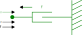
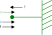

# Introduction to acausal modeling for physical systems with ModelingToolkit.jl

## Background
### Modeling Tools Reference
The following list is a reference of the tools used for building advanced models in Julia:
- [ForwardDiff.jl](https://github.com/JuliaDiff/ForwardDiff.jl)
- [DifferentialEquations.jl](https://github.com/SciML/DifferentialEquations.jl)
- [Symbolics.jl](https://github.com/JuliaSymbolics/Symbolics.jl)
- [ModelingToolkit.jl](https://github.com/SciML/ModelingToolkit.jl)
- [ModelingToolkitStandardLibrary.jl](https://github.com/SciML/ModelingToolkitStandardLibrary.jl)


### Julia
This course will use Julia as the fundamental tool to solve numerical problems.  ModelingToolkit.jl is a package written in pure Julia and leverages the fundamental technologies of symbolic math from Symbolics.jl, numerical solvers from DifferentialEquations.jl, and automatic differentiation from ForwardDiff.jl.  To demonstrate an introduction to these technologeies, lets focus on one of the most fundamental engineering problems: the *mass-spring-damper*.  For now, let's leave the mass out of the system to avoid the 2nd derivative term and assume a non-linear spring (``k \cdot x^{1.5}``)


This system can be represented by the ordinary differential equation (ODE):

```math
d \cdot \dot{x} + k \cdot x^{1.5} = F
```


To solve this in Julia we can apply finite differencing ``\dot{x}_i = \frac{x_i - x_{i-1}}{\Delta t}`` and [Newton's method](https://en.wikipedia.org/wiki/Newton%27s_method).  Here we solve for the first time step...

```@example l1
using ForwardDiff
using Plots

d=1      # damping coefficient [N/(m/s)]
k=1000   # spring stiffness [N/m]
Δt=1e-3  # time step [s]
F = 100  # input force [N]

function f(xᵢ, xᵢ₋₁)

    ẋᵢ = (xᵢ - xᵢ₋₁)/Δt     # finite difference derivative
    lhs = d*ẋᵢ + k*xᵢ^1.5   # lhs --> left hand side
    rhs = F                 # rhs --> right hand side

    return lhs - rhs     # equation --> lhs = rhs, residual --> 0 = lhs - rhs
end

# Newton's Method
# first time step (i=2)
xᵢ₋₁ = 0.0
xᵢ = xᵢ₋₁ #<-- guess
g(xᵢ) = f(xᵢ, xᵢ₋₁)  # g(xᵢ) turns f(xᵢ, xᵢ₋₁) into a function of only xᵢ
# Run Newton Iterations
xᵢ -= g(xᵢ)/ForwardDiff.derivative(g, xᵢ) # iteration 1
xᵢ -= g(xᵢ)/ForwardDiff.derivative(g, xᵢ) # iteration 2
xᵢ -= g(xᵢ)/ForwardDiff.derivative(g, xᵢ) # iteration 3
```

!!! note "about derivatives"
    We can get the derivative for `f` from automatic differentiation using `ForwardDiff.derivative` (or using `ForwardDiff.jacobian` for a system of equations).

To solve for a series of time steps, we can simply update `x` and run again for each time step `Δt`.  This is a simple form of the Implicit/Backwards Euler method.

```@example l1
tol = 1e-3
x = zeros(10)
for i=2:10
    g(xᵢ) = f(xᵢ, x[i-1])
    Δx = Inf
    while abs(Δx) > tol
        Δx = g(x[i])/ForwardDiff.derivative(g, x[i]) 
        x[i] -= Δx
    end
end

plot(x; ylabel="x [m]", xlabel="time step")
```


### DifferentialEquations.jl
For this simple problem it's easy enough to implement the Newton method and solve directly, however it's possible to instead use the solvers from DifferentialEquations.jl.  To do this, we simply need to defined a `NonlinearProblem` by supplying the function `f` of the form ``f(u,p)`` where:

- ``u`` is the variables (scalar or vector)
- ``p`` is the parameters (scalar or vector)

In this case ``u`` and ``p`` correspond to `xᵢ` and `xᵢ₋₁`, respectively.  This is referred to as the "out-of-place" form, where each call to `f` allocates, it is also possible to define ``f(du,u,p)`` as "in-place" form that gives ``du`` as a pre-allocated memory space to mutate.  

Then we can solve by specifying the method, in this case we specify `NewtonRaphson` to implement Newton's method.

```@example l1
using DifferentialEquations

p  = xᵢ₋₁ = 0.0 # initial condition if i=2, x[1]=0 
u0 = xᵢ = xᵢ₋₁  # guess value for x[i]

prob = NonlinearProblem(f, u0, p)
sol=solve(prob, NewtonRaphson(); abstol=tol)
```

Note:  we get exactly the same result for the first time step.

To solve for a series of time steps, we can now use the `remake` function to update the initial guess `u0` and parameter `p` and generate an updated `NonlinearProblem` efficiently (i.e. with minimal allocations).

```@example l1
x = zeros(10)
for i=2:10
    prob′ = remake(prob; u0=x[i], p=x[i-1])
    sol = solve(prob′, NewtonRaphson(); abstol=tol)
    x[i] = sol[]
end
plot(x; ylabel="x [m]", xlabel="time step")
```

This approach requires the use of finite differencing and building a solution vector of solves for each time step, which was done only for demonstration purposes.  Since this problem is an ODE, it can and should be solved directly with an ODE solver.  To do this with DifferentialEquations.jl, we simply re-arrange the equation to solve explicitly for the derivative of ``x``, giving the form ``\frac{\partial u}{\partial t} = f(u,p,t)``.  In this case we have

```math
\dot{x}= \frac{F - k \cdot x^{1.5}}{d}
```


```@example l1
function du_dt(u,p,t)
    F, k, d = p
    x = u
    return (F - k*x^1.5)/d
end
u0 = 0.0            # initial value for x
p = [F, k, d]       # parameters
tspan = (0.0, 0.01) # solution time span
prob = ODEProblem(du_dt, u0, tspan, p) 
sol = solve(prob)
plot(sol; xlabel="time [s]", ylabel="x [m]")
```

In some cases, it may not be so easy to rearrange the equations in such a way to provide an ODE form.  We can also solve the problem in another way: Differential Algebraic Equations (DAE) form.  Here we have a mix of differential and algebraic equations.  A mass matrix is used to specify which equations are differential vs. algebraic.  Note that we are now solving for both ``x`` and ``\dot{x}`` and therefore need to supply initial conditions for each.  To satisfy the system at time 0 with ``x=0``, we can see that ``\dot{x} = \frac{F}{d}``.  

!!! note "about initial conditions"
    Technically the initial condition `u0` can be either a guess or explicit.  By default it is treated as a guess value and an algorithm is used to solve for a `u0` that satisfies the system at the initial time.  See the documentation for the [`initializealg` keyword](https://docs.sciml.ai/DiffEqDocs/stable/solvers/dae_solve/#Initialization-Schemes) for more information.


```@example l1
function du_dt(u,p,t)
    F, k, d = p
    x, ẋ = u
    
    eqs = [
        ẋ                       # D(x) = ẋ
        (d*ẋ + k*x^1.5) - (F)   #    0 = ( lhs ) - ( rhs )
    ]

    return eqs
end

fmm = ODEFunction(du_dt; mass_matrix=[1 0; 0 0])
u0 = [0.0, F/d] # initial value for x,ẋ
prob = ODEProblem(fmm, u0, tspan, p)
sol = solve(prob)
plot(sol; idxs=1, xlabel="time [s]", ylabel="x [m]")
```

Now, maybe we would like to know the 2nd derivative of ``x``.  It should be easy enough to simply provide this in our function and solve.

```@example l1
function du_dt(u,p,t)
    F, k, d = p
    x, ẋ, ẍ = u
    
    eqs = [
        ẋ                       # D(x) = ẋ
        ẍ                       # D(ẋ) = ẍ
        (d*ẋ + k*(x^1.5)) - (F)   #    0 = ( lhs ) - ( rhs )
    ]

    return eqs
end

fmm = ODEFunction(du_dt; mass_matrix=[1 0 0;0 1 0;0 0 0])
u0 = [0.0, F/d, 0.0] # initial value for x, ẋ, ẍ
prob = ODEProblem(fmm, u0, tspan, p)
sol = solve(prob);
sol.retcode
```

Now we get a `DtLessThanMin` code, meaning the solver failed to converge.  The reason for this is an index problem, our algebraic constraint equation does not use the 2nd derivative term ``\ddot{x}``.  To solve index problems, the algrebraic constraints must be differentiated until they contain the highest order terms.  This can be done as an exercise, however, this provides a perfect segue to the tool that can make all this easier and automatic: ModelingToolkit.jl

### ModelingToolkit.jl
ModelingToolkit.jl uses symbolic math from Symbolics.jl to provide automatic index reduction and problem simplification to provide the optimal form for a numerical solver.  To define the same problem attempted previously in ModelingToolkit.jl, we first specify an independent variable ``t`` and it's differential operator

```@example l1
using ModelingToolkit
using ModelingToolkit: t_nounits as t, D_nounits as D
nothing # hide
```

!!! note "about Symbolics"
    Note that `t` is now a symbolic term.  Writing `sin(t)` does not compute anything, it simply represents the function symbolically.  Writing `D(sin(t))` then represents the derivative of `sin(t)` with respect to `t`.  To compute the derivative, we can use the function `expand_derivatives`

    ```@example l1
    D(sin(t)) |> expand_derivatives
    ```

To assemble a problem symbolically for ModelingToolkit.jl, we can define our variables and equations like

```@example l1
pars = @parameters F=100 d=1 k=1000
vars = @variables x(t)=0.0 ẋ(t)=F/d ẍ(t)=0.0
eqs = [
    D(x) ~ ẋ
    D(ẋ) ~ ẍ
    d*ẋ + k*x^1.5 ~ F
]
nothing # hide
```

Note the variables are defined as a function of the independent variable `t` and given initial conditions which are captured in the variable `vars`.  The equations are then defined using the tilde `~` operator, which represents the equation equality.  This information is then fed to an `ODESystem` constructor and simplified using the `structural_simplify` function.  

```@example l1
@mtkbuild odesys = ODESystem(eqs, t, vars, pars)
```

As can be seen, the 3 equation system is simplified down to 1 equation.  To see the solved states and equations we can use the respective functions

```@example l1
unknowns(odesys)
```

Now we are solving for only `x(t)` with the equation:

```@example l1
equations(odesys)
```

This seems correct, but what is `ẋ(t)`?  This variable has been moved to the observables of the system, which are terms which can be computed algebraicly.

```@example l1
observed(odesys)
```

Notice how the 2nd derivative term `ẍ(t)` has been automatically determined from the symbolic derivative of `ẋ(t)`.

We can now assembly a problem and solve it.  The initial conditions do not need to be supplied here because the `sys` contains the variable defaults from `vars`.  The solution object `sol` can now be indexed symbolically from any symbol of the system regardless if it's a solved variable, observable, or even a parameter.  This way, if for example doing a batch of simulations, each respective solution object can easily retrieve all respective information about the simulation.

```@example l1
u0 = [] # <-- used to override defaults of ODESystem variables
p = [] # <-- used to override defaults of ODESystem parameters
prob = ODEProblem(odesys, u0, tspan, p)
sol = solve(prob; abstol=tol)
plot(sol; idxs=ẍ, xlabel="time [s]", ylabel="ẍ [m/s^2]")
```

Using ModelingToolkit.jl, the solution can also be indexed by expression, for example plotting the damping and spring force components can be done as so

```@example l1
plot(sol; idxs=x^1.5*k, xlabel="time [s]", ylabel="force [N]")
plot!(sol; idxs=ẋ*d)
```


## Acausal - Component Based Modeling
ModelingToolkit.jl enables the application of Physical Network Acausal modeling, which is a type of modeling which is component based allowing one to build models by assembling parts together from a library.  The key to how this works is thru a simple rule of how components are connected.  A connection must define at minimum 2 variables (*through* and *across* see [about connectors](https://docs.sciml.ai/ModelingToolkitStandardLibrary/stable/connectors/connections/) for a deeper explanation) which follows the rules:

- connections can only be made by *like* connectors (i.e. same pairs of *through* and *across* variables from the same physical domain)
- *through* variables sum to zero at connection points
- *across* variables are equal at connection points

Consider a simple mechanical translational system of a mass and damper.  In this domain the *through* variable is force (``f``) and the *across* velocity (``v``).  We can define the mass component as

```math
f_{mass} = m_{mass} \cdot \dot{v}_{mass}
```

And the damper component as

```math
f_{damper} = d_{damper} \cdot v_{damper}
```

Based on the rules above, connecting these 2 components together would give the following additional equations

```math
\begin{aligned} 
    0 &= f_{mass} + f_{damper} \\ 
    v_{mass} &= v_{damper} 
\end{aligned}  
```

With simple substitution it can be seen that this gives the expected mass-damper system

```math
m \cdot \dot{v} + d \cdot v = 0
```


Let's try this again by defining this system in ModelingToolkit.jl


### Connections
To define a connection in ModelingToolkit.jl we use the `@connector` macro and specify the *through* variable with `connect = Flow`

```@example l1 
@connector MechanicalPort begin
    v(t)
    f(t), [connect = Flow]
end
nothing # hide
```


### Components
To define a component, we use the `@mtkmodel` macro and define it's parameters, variables, connection ports, and equations.  The mass component can be defined as

```@example l1 
@mtkmodel Mass begin
    @parameters begin
        m = 10
    end
    @variables begin
        v(t)
        f(t)
    end
    @components begin
        port = MechanicalPort()
    end
    @equations begin
        # connectors
        port.v ~ v
        port.f ~ f
        
        # physics
        f ~ m*D(v)
    end
end
nothing # hide
```

Now there are 2 tricky issues when defining models at the component level.  First is the number of equations.  How can you know if you've properly defined a base component without having the remaining parts to close the system and ensure you have a matching set of variables and equations?  A general rule of thumb is that a base level component should have an equation number that matches the number of variables + connectors.  The `Mass` component has 2 variables and 1 connector and therefore 3 equations.

The 2nd tricky issue is signs.  To determine this one can draw a diagram like below.  Below the port draw the across variable from left to right (positive) direction.  Then draw the through variable *entering* the component.  If the arrows point in the same direction, the connection port through variable assignment is positive, if opposing, then the sign should be negative.  


Similarly the damper component is defined as below.  

```@example l1 
@mtkmodel Damper begin
    @parameters begin
        d = 1
    end
    @variables begin
        v(t)
        f(t)
    end
    @components begin
        port = MechanicalPort()
    end
    @equations begin
        # connectors
        port.v ~ v
        port.f ~ f
        
        # physics
        f ~ d*v
    end
end
nothing # hide
```



Now the `Mass` and `Damper` components can be assembled in a system and connected together (note: the `connect` equation).  Also note the parameters `v`, `m`, and `d` are defined to expose the properties which can be set as keyword arguments of the same name.  

```@example l1 
@mtkmodel System begin
    @parameters begin
        v
        m
        d
    end
    @components begin
        mass = Mass(;v,m)
        damper = Damper(;v,d)
    end
    @equations begin
        connect(mass.port, damper.port)
    end
end

@mtkbuild sys = System(;v=100, m=5, d=3)
full_equations(sys)
```

As can be seen we arrive at the same equation as derived previously.  Now it would be easy to define a system that adds a spring, or has a series of connected masses, springs, dampers, etc.  


The `Damper` component created previously was a little incomplete because it only had one port.  In reality a damper or spring will be connected between 2 objects, for example the car frame and the wheel.  Therefore a proper component will define 2 ports so that the component can be as analogous with real life as possible.  In the example below the component is defined properly with 2 ports.  Note the velocity of the component `v` is defined as a relative velocity between the 2 ports.  It's easy to understand how this works if it's assumed that `port_b` is connected to a stationary reference frame.

```@example l1 
@mtkmodel Damper begin
    @parameters begin
        d = 1
    end
    @variables begin
        v(t)
        f(t)
    end
    @components begin
        port_a = MechanicalPort()
        port_b = MechanicalPort()
    end
    @equations begin
        # connectors
        (port_a.v - port_b.v) ~ v
        port_a.f ~ +f
        port_b.f ~ -f
        
        # physics
        f ~ d*v
    end
end
nothing # hide
```

Note the force is drawn now as entering the component on both sides.  For port `a` the directions align, but for port `b` the directions are opposing, requiring a sign change: `port_b.f ~ -f`


Now we can do the same for the spring component.  Note that the spring is of course very similar to the damper, but now we need a relative position.  This can be obtained by integrating the port velocities, but how do we integrate in ModelingToolkit.jl?  We want to write the equation

```math
x = \int v \space \partial t
```

But we know that this is also true

```math
\frac{\partial x}{\partial t} = v
```


In ModelingToolkit therefore we can "integrate" by moving the differential to the appropriate side of the equation.

```@example l1 
@mtkmodel Spring begin
    @parameters begin
        k = 100
    end
    @variables begin
        x(t)
        v(t)
        f(t)
    end
    @components begin
        port_a = MechanicalPort()
        port_b = MechanicalPort()
    end
    @equations begin
        # derivatives
        D(x) ~ v

        # connectors
        (port_a.v - port_b.v) ~ v
        port_a.f ~ +f
        port_b.f ~ -f
        
        # physics
        f ~ k*x
    end
end
nothing # hide
```


One thing to consider now in the `Spring` component is the meaning of the spring stretch/compression variable `x`.  What does it mean if this variable is positive or negative?  It's important to note when reviewing the model output that a positive `x` means the spring is compressed and vise versa for a negative `x`.

Now, if we want to create a full *mass-spring-damper* system with our new `Damper` and `Spring` components, we need to create some boundary conditions, such as a stationary reference and an input force.  Creating a stationary reference in acausal modeling is a bit tricky.  We know that the velocity should be set to zero, as it's stationary.  But what should the force be?  Thinking about Newton's principles, every force on a non-moving object is met with an equal but opposite force.  Therefore we add a variable `f` to represent this force, which will be part of the solved system solution. 


```@example l1 
@mtkmodel Reference begin
    @parameters begin
        
    end
    @variables begin
        f(t)
    end
    @components begin
        port = MechanicalPort(;f,v=0)
    end
    @equations begin
        # connectors
        port.v ~ 0
        port.f ~ -f
    end
end
nothing # hide
```

Note the sign convention `port.f ~ -f`.  This is maybe not expected.  To understand why a negative is needed here is because this component is different from the others, there is no physics involved.  The component is instead only a boundary condition, therefore force should be *leaving* the component rather than entering.



Finally, considering an input force, we can imagine this to be an invisible hand that pushes with a constant force.  This invisible hand will move with the port with velocity `v`.  We don't know this velocity, it's a variable that will part of the solved system solution.  

```@example l1 
@mtkmodel ConstantForce begin
    @parameters begin
        f
    end
    @variables begin
        v(t)
    end
    @components begin
        port = MechanicalPort()
    end
    @equations begin
        # connectors
        port.v ~ v
        port.f ~ -f  
    end
end
nothing # hide
```

As with the `Reference` component, the force is a boundary condition and is leaving the component rather than entering, giving the sign convention `port.f ~ -f`.


Now let's assemble a *mass-spring-damper* system with the full collection of components.

```@example l1 
@mtkmodel System begin
    @parameters begin
        v=0
        x=0
        m=100
        d=10
        k=1000
        f=1
    end
    @components begin
        mass = Mass(;v,m)
        damper = Damper(;v, d)
        spring = Spring(;v, k, x)
        ref = Reference()
        force = ConstantForce(;v,f)
    end
    @equations begin
        connect(mass.port, damper.port_a, spring.port_a, force.port)
        connect(damper.port_b, spring.port_b, ref.port)
    end
end

@mtkbuild sys = System()
prob = ODEProblem(sys, [], (0, 10))
sol = solve(prob)
plot(sol)
```

There's a couple things we can do now to ensure the system is correct.  First, we can look at the equations.

```@example l1 
full_equations(sys)
```

The first equation (after re-aranging) it can be seen is the classic *mass-spring-damper* equation.

```math
m \cdot \ddot{x} + d \cdot \dot{x} + k \cdot x = f
```

This way we know all the signs and equations are set correctly.  Let's also check the `Reference` component sign, which should give an equal but opposite force to the system connected to it.

```@example l1
plot(sol; idxs=sys.ref.f)
plot!(sol; idxs=sys.spring.f + sys.damper.f)
```

Additionally it's easy enough in this case to re-construct the problem directly and solve to check the result.

```@example l1 
vars = @variables x(t)=0 dx(t)=0 ddx(t)=0
pars = @parameters m=100 d=10 k=1000 F=1
eqs = [
    D(x) ~ dx
    D(dx) ~ ddx
    m*ddx + d*dx + k*x ~ F
]
@mtkbuild odesys = ODESystem(eqs, t, vars, pars)
sys = structural_simplify(odesys)
prob = ODEProblem(sys, [], (0,10))
sol = solve(prob)
plot(sol)
```


### Systems and Sub-Systems
Acausal modeling allows for an "object-oriented" like system that can organize models with hierarchy.  Let's say for example we want to make a part that is a collection of the mass, spring, damper into a single system.  The `MassSpringDamper` component below shows how this is possible.  As can be seen, this is nearly the same system we generated previously, except no boundary conditions are given, instead 2 `MechanicalPort`'s are added and connected to the component parts.  These connection points are now exposed and can be connected to other components.

```@example l1
@mtkmodel MassSpringDamper begin
    @parameters begin
        m
        k
        d
        v
        x
    end
    @components begin
        port_a = MechanicalPort()
        port_b = MechanicalPort()
        mass = Mass(;m,v)
        damper = Damper(;d,v)
        spring = Spring(;k,v,x)
    end
    @equations begin
        connect(mass.port, damper.port_a, spring.port_a, port_a)
        connect(damper.port_b, spring.port_b, port_b)
    end
end
nothing # hide
```

As an example, the `MassSpringDamper` component can be connected in series to make a complex system.  One can imagine then how this enables easy construction of complex models that can be quickly modified, extremely useful for the application of model based design.  

```@example l1
@mtkmodel System begin
    @parameters begin
        v = 0
        x = 0
    end
    @components begin
        msd1 = MassSpringDamper(;m = 10, d = 1, k = 1000, v, x)
        msd2 = MassSpringDamper(;m = 20, d = 2, k = 2000, v, x)
        msd3 = MassSpringDamper(;m = 30, d = 3, k = 3000, v, x)
        ref = Reference()
        force = ConstantForce(;f=1,v=0)
    end
    @equations begin
        connect(force.port, msd1.port_a)
        connect(msd1.port_b, msd2.port_a)
        connect(msd2.port_b, msd3.port_a)
        connect(msd3.port_b, ref.port)
    end
end

@mtkbuild sys = System()
prob = ODEProblem(sys, [], (0, 2))
sol = solve(prob)
plot(sol; idxs=[sys.msd1.spring.x, sys.msd2.spring.x, sys.msd3.spring.x])
```

### Practice Exercise
The current solution shows how the springs are compressed.  How can the model be updated to show the absolute positions of the springs?  For example, if each spring starts at an unstreched length of 10mm, connected together they will form a collection of 30mm with masses inbetween.  Update the model to show the absolute position of each mass in time.

