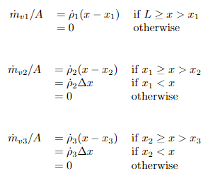

# Lecture 2: Developing high-fidelity models of hydraulic systems
Why focus on hydraulics?  The answer is essentially hydraulic modelling is really hard (in numerical computing terms, hydraulic models are often referred to as "stiff" ODE's, which require more rigorous solvers from standard ODE's).  Solving the challenges of modeling hydraulics is applicable to the numerical modeling challenges of all other domains.  Let's first start with the concept of *compressibility*.  Often we think of a liquid as incompressible, imagine attempting to "squeeze" water, it can be done but takes some very high forces.  Therefore, if the model in question won't be solving a problem with high forces, it can be assumed incompressible.  However, most hydrulic industrial models will involve high forces, this is precisely the area where most hydraulic machines are used.  

## Compressibility

### Density

Density is simply mass over volume

```math
\rho = m/V
```

Given a volume and mass of liquid, if the volume were to change from ``V_0`` to ``V``, we know that the pressure would increase, and since the mass in this case was constant, the density will increase as well.


The change in pressure for an isothermal compressible process is typically given as

```math
\Delta p = -\beta \frac{\Delta V}{V_0}
```

### Calculating Density as a Function of Pressure

Substituting ``\Delta p`` and ``\Delta V``

```math
p - p_0 = -\beta \frac{V - V_0}{V_0}
```

substituting ``V = m / \rho ``

```math
p - p_0 = -\beta (1 - \rho/\rho_0)  
``` 

Solving for ``\rho``

```math
\rho = \rho_0 (1 + (p - p_0)/\beta)
```

Taking a known ``\rho_0`` when ``p_0`` is 0 (at gage pressure), simplifies to

```math
\rho = \rho_0 (1 + p/\beta) 
```

### Change in Mass

Conservation of mass gives us

```math
m_{in} - m_{out} = m_s 
```

The stored mass of oil is simply

```math
m_s = \rho V 
```

Taking the derivative gives us the rate of mass change

```math
\dot{m}_{in} - \dot{m}_{out} = \frac{\delta (\rho V)}{\delta t} 
```

Here is where the standard hydraulic modeling often makes a simplification.  

Correct Derivation (1):  

```math
\frac{\delta (\rho V)}{\delta t} = \dot{\rho} V + \rho \dot{V} 
```

Standard Practice[^1] (2):  

```math
\color{red} \frac{\delta (\rho V)}{\delta t} = \dot{\rho} V + \rho_0 \dot{V}   
```

Given ``\dot{\rho} = \rho_0 (\dot{p} / \beta)``, and ``q = \dot{m}/\rho_0`` the above is often written as

```math
\color{red} q_{in} - q_{out} = (\dot{p} / \beta) V + \dot{V} 
```

[^1]: See [simscape hydraulic chamber](https://www.mathworks.com/help/simscape/ref/variablehydraulicchamber.html).  Note the deprecation warning moving to isothermal liquid library which uses the correct derivation.

### Example
Problem Definition - Given:

- ``M = 10,000 kg``
- ``A = 900 cm^2`` 
- ``\rho_0 = 876 kg/m^3``
- ``\beta = 1.2e9 Pa/m^3``
- ``g = 9.807 m/s^2``


Find the mass flow rate (``\dot{m}``) that provides a sinusodial output of ``x``:

```math
x(t) = amp \cdot sin(2πtf) + x_0
```

There are 3 fundamental equations needed to solve this problem, **(1) Mass balance**: 

```math
\dot{m} = \dot{\rho} \cdot V + \rho \cdot \dot{V}
```

where ``V`` is the cylinder volume ``=x \cdot A``

**(2) Newton's law**:

```math
m \cdot \ddot{x} = p*A - m*g
```

And the **(3) Density equation**.  


The variables of this system are ``x``, ``p``, ``\rho``, and ``\dot{m}``.  By including 1 input condition that gives 4 equations and 4 variables to be solved.  Now, the problem to be solved is, "what is the mass flow rate, ``\dot{m}``, that gives the desired sinusodial ``x``?  There are 2 ways to go about finding the correct ``\dot{m}``.  The first is to guess.  We know that mass flow rate thru a pipe is equal to 

```math
\dot{m} = \rho \bar{u} A
```

where ``\bar{u}`` is the average flow velocity thru cross section ``A``.  We can assume that ``\bar{u} \approx \dot{x}``.  Therefore we have

```math
\dot{m} = \rho \cdot \dot{x} \cdot A
```

The second way to find the correct ``\dot{m}`` is to solve for it directly.  We can do this by simply supplying the target ``x`` function as the input to the system.  In this example we will do both and compare the results.

To solve this in ModelingToolkit.jl, let's start by defining our parameters and `x` function

```@example l2
using ModelingToolkit
using DifferentialEquations
using Symbolics
using Plots

@parameters t
D = Differential(t)

# parameters -------
pars = @parameters begin
    r₀ = 876 #kg/s
    β = 1.2e9 #Pa
    A = 0.01 #m²
    x₀ = 1.0 #m
    M = 10_000 #kg
    g = 9.807 #m/s²
    amp = 5e-2 #m
    f = 15 #Hz    
end

dt = 1e-4 #s
t_end = 0.2 #s
time = 0:dt:t_end

x_fun(t,amp,f) = amp*sin(2π*t*f) + x₀
```

Now, to supply ``\dot{m}`` we need an ``\dot{x}`` function.  This can be automatically generated for us with Symbolics.jl

```@example l2
ẋ_fun = build_function(expand_derivatives(D(x_fun(t,amp,f))), t, amp, f; expression=false)
```

As can be seen, we get a `cos` function as expected taking the derivative of `sin`.  Now let's build the variables and equations of our system.  The base equations are generated in a function so we can easily compare the correct derivation of mass balance (`density_type = r(t)`) with the standard practice (`density_type = r₀`).

```@example l2
vars = @variables begin
    x(t) = x₀
    ẋ(t)
    ẍ(t)
    p(t) = M*g/A #Pa
    ṁ(t)
    r(t)
    ṙ(t)
end 

function get_base_equations(density_type) 
    
    eqs = [
        D(x) ~ ẋ 
        D(ẋ) ~ ẍ
        D(r) ~ ṙ

        r ~ r₀*(1 + p/β)

        ṁ ~ ṙ*x*A + (density_type)*ẋ*A
        M*ẍ ~ p*A - M*g
    ]

    return eqs
end
```

Note: we've only specified the initial values for the known states of `x` and `p`.  We will find the additional unknown initial conditions before solving.  Now we have 7 variables defined and only 6 equations, missing the final driving input equation.  Let's build 3 different cases:

- case 1: mass flow guess using standard practice mass flow balance

```@example l2
eqs_ṁ1 = [
    get_base_equations(r₀)...
    ṁ ~ ẋ_fun(t,amp,f)*A*r # (4) Input - mass flow guess
]
```

- case 2: mass flow guess using correct compressibility equation

```@example l2
eqs_ṁ2 = [
    get_base_equations(r)...
    ṁ ~ ẋ_fun(t,amp,f)*A*r # (4) Input - mass flow guess
]
```

- case 3: solution

```@example l2
eqs_x = [
    get_base_equations(r)...
    x ~ x_fun(t,amp,f) # (4) Input - target x 
]
```

Now we have 3 sets of equations, let's construct the systems and solve.  If we start with the 3rd system with the target ``x`` input, notice that the `structural_simplify` step outputs a system with 0 equations!

```@example l2
@named odesys_x = ODESystem(eqs_x, t, vars, pars)
sys_x = structural_simplify(odesys_x)
```

What this means is ModelingToolkit.jl has found that this model can be solved entirely analytically.  The full system of equations has been moved to what is called "observables", which can be obtained using the `observed()` function

```@example l2
observed(sys_x)
```

!!! note "dummy derivatives"
    Some of the observables have a `ˍt` appended to the name.  These are called dummy derivatives, which are a consequence of the algorithm to reduce the system DAE index.  

This system can still be "solved" using the same steps to generate an `ODESolution` which allows us to easily obtain any calculated observed state.

```@example l2
prob_x = ODEProblem(sys_x, [], (0, t_end))
sol_x = solve(prob_x; saveat=time)
plot(sol_x; idxs=ṁ)
```

Now let's solve the other system and compare the results. 

```@example l2
@named odesys_ṁ1 = ODESystem(eqs_ṁ1, t, vars, pars)
sys_ṁ1 = structural_simplify(odesys_ṁ1)
```

Notice that now, with a simple change of the system input variable, `structural_simplify()` outputs a system with 4 states to be solved.  We can find the initial conditions needed for these states from `sol_x` and solve.

```@example l2
u0 = [sol_x[s][1] for s in states(sys_ṁ1)]
prob_ṁ1 = ODEProblem(sys_ṁ1, u0, (0, t_end))
sol_ṁ1 = solve(prob_ṁ1)
```

The resulting mass flow rate required to hit the target ``x`` position can be seen to be completely wrong.  This is the large impact that compressibility can have when high forces are involved.

```@example l2
plot(sol_ṁ1; idxs=ṁ, label="guess", ylabel="ṁ")
plot!(sol_x; idxs=ṁ, label="solution")
```

If we now solve for case 2, we can study the impact the compressibility derivation

```@example l2
@named odesys_ṁ2 = ODESystem(eqs_ṁ2, t, vars, pars)
sys_ṁ2 = structural_simplify(odesys_ṁ2)
prob_ṁ2 = ODEProblem(sys_ṁ2, u0, (0, t_end))
sol_ṁ2 = solve(prob_ṁ2)
```

As can be seen, a significant error forms between the 2 cases. 

```@example l2
plot(sol_x; idxs=x, label="solution", ylabel="x")
plot!(sol_ṁ1; idxs=x, label="case 1: r₀")
plot!(sol_ṁ2; idxs=x, label="case 2: r")
```

```@example l2
plot(time, (sol_ṁ1(time)[x] .- sol_ṁ2(time)[x])/1e-3, label="x", ylabel="error (case 1 - case 2) [mm]", xlabel="t [s]")
```


### Practice Problem
Now let's re-create this example using components from the ModelingToolkitStandardLibrary.jl.  It can be shown that by connecting `Mass` and `Volume` components that the same exact result is achieved.  The important thing is to pay very close attention to the initial conditions.  

```@example l2
import ModelingToolkitStandardLibrary.Mechanical.Translational as T
import ModelingToolkitStandardLibrary.Hydraulic.IsothermalCompressible as IC
import ModelingToolkitStandardLibrary.Blocks as B

using DataInterpolations
mass_flow_fun = LinearInterpolation(sol_x[ṁ], sol_x.t)

include("volume.jl") # <-- missing Volume component from MTKSL (will be released in new version) 

function MassVolume(; name, dx, drho, dm)

    pars = @parameters begin
        A = 0.01 #m²
        x₀ = 1.0 #m
        M = 10_000 #kg
        g = 9.807 #m/s²
        amp = 5e-2 #m
        f = 15 #Hz   
        p_int=M*g/A
        dx=dx
        drho=drho
        dm=dm
    end
    vars = []
    systems = @named begin
        fluid = IC.HydraulicFluid(; density = 876, bulk_modulus = 1.2e9)
        mass = T.Mass(;v=dx,m=M,g=-g)
        vol = Volume(;area=A, x=x₀, p=p_int, dx, drho, dm) # <-- missing Volume component from MTKSL (will be released in new version) 
        mass_flow = IC.MassFlow(;p_int)
        mass_flow_input = B.TimeVaryingFunction(;f = mass_flow_fun)
    end

    eqs = [
        connect(mass.flange, vol.flange)
        connect(vol.port, mass_flow.port)
        connect(mass_flow.dm, mass_flow_input.output)
        connect(mass_flow.port, fluid)
    ]

    return ODESystem(eqs, t, vars, pars; systems, name)
end

dx = sol_x[ẋ][1]
drho = sol_x[ṙ][1]
dm = sol_x[ṁ][1]

@named odesys = MassVolume(; dx, drho, dm)

sys = structural_simplify(odesys)

prob = ODEProblem(sys, [], (0, t_end))
sol=solve(prob)

plot(sol; idxs=sys.vol.x, linewidth=2)
plot!(sol_x; idxs=x)
```

## Momentum Balance
The next challenging aspect of hydraulic modeling is modeling flow through a pipe, which for compressible flow requires resolving the momentum balance equation. To derive the momentum balance we can draw a control volume (cv) in a pipe with area $A$, as shown in the figure below, and apply Newton's second law.  Across this control volume from $x_1$ to $x_2$ the pressure will change from $p_1$ to $p_2$.  Assuming this is written for an acausal component we put nodes at $p_1$ to $p_2$ which will have equal mass flow $\dot{m}$ entering and exiting the cv[^2].

[^2]: The Modelica Standard Library combines the mass and momentum balance to the same base class, therefore, mass flow in and out of the cv is not equal, which introduces an additional term to the lhs of the momentum balance:  $ \frac{\partial \left( \rho u^2 A \right) }{\partial x}  $  


Now taking the sum of forces acting on the cv we have the pressure forces at each end as well as the viscous drag force from the pipe wall and the body force from gravity.  The sum of forces is equal to the product of mass ($\rho V$) and flow acceleration ($\dot{u}$).   

```math
    \rho V \dot{u} = p_1 A_1 - p_2 A_2 - F_{viscous} + \rho V g
```

!!! note "Project Idea" 
    the current implementation of this component in the ModelingToolkitStandardLibrary.jl does not include gravity force for this makes initialization challenging and will take some work to implement.


The density $\rho$ is an average of $\rho_1$ and $\rho_2$.  The velocity is also taken as an average of $u_1$ and $u_2$

```math
u_1 = \frac{\dot{m}}{\rho_1 A}
```

```math
u_2 = \frac{\dot{m}}{\rho_2 A}
```


!!! note "Conservation of Momentum"
   the term `\rho V \dot{u}` introduces what is referd to as fluid inertia.  This is what resolves the pressure wave propagation through a pipe.  A classic wave propagation example in pipes is the "water hammer" effect.  The full derivation for the flow velocity derivative is when deriving in 2 dimensions is 
   ```math 
   \frac{D \text{V}}{Dt} = \frac{\partial \text{V}}{\partial t} + \frac{\partial \text{V}}{\partial x} u + \frac{\partial \text{V}}{\partial z} w
   ```
   where $\text{v}$ is the velocity vector, $u$ and $w$ are the flow components in $x$ and $y$ directions.  In the ModelingToolkitStandardLibrary.jl this assumption is taken
   ```math
   \rho V \frac{D \text{V}}{Dt} \approx \frac{\partial \dot{m}}{\partial t}
   ```  
   

!!! note "Project Idea"
    Implement a more detailed Conservation of Momentum using the standard derivation.  One idea is to implement the MethodOfLines.jl to provide the derivative in $x$.
    

### Pipe Component
To model a pipe for compressible flow, we can combine the mass balance and momentum balance components to give both mass storage and flow resistance.  Furthermore, to provide a more accurate model that allows for wave propagation we can discretize the volume connected by node of equal pressure and mass flow.  The diagram below shows an example of discretizing with 3 mass balance volumes and 2 momentum balance resistive elements.  Note: the Modelica Standard Library does this in a different way, by combining the mass and momentum balance in a single base class.  


### Dynamic Volume Component
Both Modelica and SimScape model the actuator component with simply a uniform pressure volume component.  The Modelica library defines the base fluids class around the assumption of constant length (see: [Object-Oriented Modeling of Thermo-Fluid Systems](https://elib.dlr.de/11988/1/otter2003-modelica-fluid.pdf)) and therefore adapting to a component that changes length is not possible.  But in cases with long actuators with high dynamics the pressure is not at all uniform, therefore this detail cannot be ignored.  Therefore, adding in the momentum balance to provide flow resistance and fluid inertia are necessary.  The diagram below shows the design of a `DynamicVolume` component which includes both mass and momentum balance in addition to discretization by volume.  The discretization is similar to the pipe, except the scheme becomes a bit more complicated with the moving wall ($x$).  As the volume shrinks, the control volumes will also shrink, however not in unison, but one at a time.  In this way, as the moving wall closes, the flow will come from the first volume $cv1$ and travel thru the full size remaining elements ($cv2$, $cv3$, etc.).  After the first component length drops to zero, the next element will then start to shrink.  


This design has a flaw unfortunately, expanding the system for N=3 gives 


What happens when transitioning from one cv to the next, if the moving wall velocity is significant, then an abrupt change occurs due to the $\rho_i \dot{x}$ term.  This creates an unstable condition for the solver and results in poor quality/accuracy.  To resolve this problem, the mass balance equation is split into 2 parts: mass balance 1 \& 2 

```math
\text{mass balance 1: } \dot{m}/A = \dot{\rho} x
```

```math
\text{mass balance 2: } \dot{m}/A = \rho \dot{x}
```

The below diagram explains how this component is constructed


Now the flows are simplified and are more numerically stable.  The acausal connections then handle the proper summing of flows.



