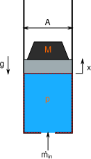

# Debugging difficult stiff ODE/DAE models

Below is a list of best practices to help avoid problems in model development and strategies that can be used to debug a problematic model.

## Best Practices
In the world of programming, debugging a model has got to be the most challenging because all equations must be solved together.  If any equation is wrong then not only will the model not solve, but there is very little that can be done to identify which equation is problematic.  Therefore the best that we can do is implement best practices to ensure the model is correct from the beginning. 

### Use acausal modeling (i.e. ModelingToolkit.jl)
As has been shown ModelingToolkit.jl will help in many ways with model definition.  One of the first programming practices that it enables is the DRY (Don't Repeat Yourself) principle.  By defining components once and reusing them, this helps reduce the chance of human error.  For example, when discovering a component level bug, it will be fixed at one source of truth and the fix will automatically propagate throughout.  

### Start small and verify components
In using acausal modeling, the main focus for ensuring well defined models lies mainly at the component level.  Make sure to implement the rules of thumb discussed previously for number of equations and sign conventions.   Each component should have a well defined unit test.  When building your model start with the smallest subsystem possible and build from there.  Attempting to build a full system model before checking the pieces is doomed to fail, leaving little to no insight into what went wrong.  When a model fails to run, the error message will rarely give enough information to pinpoint the problem.  The best tool for debugging is taking small incremental steps which allows one to identify which change caused the problem.  

### Make sure equations match states
It is not always the case, but for most models, the unsimplified system should give a match of equations and states.  Let's take the pendulum problem for example

```@example l6
using ModelingToolkit, DifferentialEquations, Plots
using ModelingToolkit: t_nounits as t, D_nounits as D
using OrdinaryDiffEqNonlinearSolve # ShampineCollocationInit, NLNewton
using OrdinaryDiffEqSDIRK # ImplicitEuler

pars = @parameters m = 1 g = 1 L = 1 Φ=0

vars = @variables begin
    x(t)=+L*cos(Φ)
    y(t)=-L*sin(Φ)
    dx(t)=0
    dy(t)=0
    λ(t) = 0
end

eqs = [
    D(x) ~ dx   
    D(y) ~ dy

    m*D(dx) ~ -λ*(x/L)
    m*D(dy) ~ -λ*(y/L) - m*g

    x^2 + y^2 ~ L^2 # algebraic constraint
]

@named pendulum = ODESystem(eqs, t, vars, pars)
nothing # hide
```

When we view the `ODESystem` we can see it has matching equations and states

```@repl l6
pendulum
```

Note: when using `@mtkbuild` then `structural_simplify` is automatically called and we therefore cannot see the unsimplify system.  Replace `@mtkbuild` with `@named` to generate an `ODESystem` without applying `structural_simplify`.


### Add compliance
The pendulum problem as described above is derived assuming the following:

- a massless perfectly stiff and rigid string/rod connected to the mass
- a point mass
- a frictionless mechanism

If we attempt to solve this system we can see that it only solves up to the point that `x` crosses 0.

```@example l6
sys = complete(structural_simplify(pendulum))
prob = ODEProblem(sys, [], (0, 10))
sol = solve(prob)# gives retcode: DtLessThanMin
plot(sol; idxs=[x,y])
```

The problem is rooted in the algebraic constraint which has `x^2` and `y^2`.  Having exponents (squares or square roots) can often cause issues with numerical solutions.  In this case the issue is that a unique solution cannot be found, `x` could be positive or negative.  There are different solutions to this problem, however lets consider the concept of adding compliance.  In reality is it really possible to have a massless, perfectly stiff and rigid string?  No.  Therefore let's consider adjusting the problem so the string has stiffness, which means we add `L` now as a variable.

```@example l6
pars = @parameters m = 1 g = 1 L_0 = 1 Φ=0 k=1e6

vars = @variables begin
    L(t)=L_0
    x(t)=+L*cos(Φ)
    y(t)=-L*sin(Φ)
    dx(t)=0
    dy(t)=0
    λ(t) = 0
end

eqs = [
    D(x) ~ dx   
    D(y) ~ dy

    m*D(dx) ~ -λ*(x/L)
    m*D(dy) ~ -λ*(y/L) - m*g

    x^2 + y^2 ~ L^2 # algebraic constraint

    λ ~ k*(L - L_0) # string stiffness
]

@named stiffness_pendulum = ODESystem(eqs, t, vars, pars)
sys = structural_simplify(stiffness_pendulum)
prob = ODEProblem(sys, [], (0, 10))
sol = solve(prob)# Success
plot(sol; idxs=[x,y])
```


### Try `dae_index_lowering()`
In some cases we can apply `dae_index_lowering()` to further simplify the problem.  In this case ModelingToolkit.jl finds a better form of the equations which can be solved without issue.

```@example l6
sys = structural_simplify(dae_index_lowering(pendulum))
prob = ODEProblem(sys, [], (0, 10))
ref = solve(prob)
plot(ref; idxs=x, label="dae_index_lowering")
plot!(sol; idxs=x, label="compliance")
```


### Design components with variable complexity/fidelity
In general this can be achieved with parameters.  For example, a *mass-spring-damper* system can easily become a *mass-damper* system by setting the spring stiffness to zero.  But in other cases we might want to *structurally* variable the complexity.  For example, the `ModelingToolkitStandardLibrary.Hydraulic.IsothermalCompressible.Tube` component has 2 structural parameters:

- `N` for discretization
- `add_inertia` for including the wave equation

Based on the inputs of these structural parameters, the number of generated equations will be different.  Therefore, to start simple, one can set `N=0` and `add_inertia=false` to generate the simplest form of the problem.  Solving this case first and ensuring the model physical behavior is correct is a good best practice before attempting to increase the fidelity of the model.  


### Check values of parameters
Another possible cause of problems in your model can come not from the equations, but from the parameters that are supplied to the equations.  As discussed previously, models are stiff not because of their equations but because of the parameters.  It's always a good idea to ensure your parameters match real life values to some degree. To ensure human error is not factoring in, it can be a good idea to use units (note ModelingToolkit v9 will be enforcing units using Uniful.jl).  If you know all of your parameters are correct but still having issues, another debugging strategy is to reduce the energy input of your system.  Rather than starting at 100%, start at 10%.  This gives the model a better chance to solve and with a model solution this gives some insight to what the root cause problem might be.  For example, if working with a hydraulic system, turn the input pressure down to 10%. 

### Check acausal boundary conditions
As discussed in Lecture 1, acausal connections always have a minimum of 2 variables.  Therefore, acausal input (or boundary condition) components will need to pay attention to what should be done to both variables.  As an example, refer to the hydraulic cylinder problem from Lecture 2 and consider the case where the position $x$ is supplied as the input boundary condition and the mass flow input $\dot{m}$ is set to an `Open()` boundary condition, thereby solving for $\dot{m}$ to give input $x$.



We can assemble the problem as

```@example l6
import ModelingToolkitStandardLibrary.Mechanical.Translational as T
import ModelingToolkitStandardLibrary.Hydraulic.IsothermalCompressible as IC
import ModelingToolkitStandardLibrary.Blocks as B

include("volume.jl") # <-- missing Volume component from MTKSL (will be released in new version)

function MassVolume(solves_force = true; name)

    pars = @parameters begin
        A = 0.01 #m²
        x₀ = 1.0 #m
        M = 10_000 #kg
        g = 9.807 #m/s²
        amp = 5e-2 #m
        f = 15 #Hz
        p_int=M*g/A
        dx=0
        drho=0
        dm=0
    end
    vars = []
    systems = @named begin
        fluid = IC.HydraulicFluid(; density = 876, bulk_modulus = 1.2e9)
        mass = T.Mass(;m=M,g=-g)
        vol = Volume(;area=A, x=x₀, p=p_int, dx, drho, dm) # <-- missing Volume component from MTKSL (will be released in new version)
        mass_flow = IC.Open(;p=p_int)
        position = T.Position(solves_force)
        position_input = B.TimeVaryingFunction(;f = t -> amp*sin(2π*t*f) + x₀)
    end

    eqs = [
        connect(mass.flange, vol.flange, position.flange)
        connect(vol.port, mass_flow.port)
        connect(position.s, position_input.output)
    ]

    return ODESystem(eqs, t, vars, pars; systems, name,
        initial_conditions = [mass.v => dx])
end

@named odesys = MassVolume()
nothing # hide
```

If we check the number of equations and states we see a mismatch!

```@repl l6
odesys
```

The reason for the mismatch is that the input boundary condition `Position()` needs to know what to do about the connection variable for force `f`.  In this problem, do we need a force introduced to the system to make the mass move as set by `Position()`?  The answer is no, the force causing the mass to move is already given by the hydraulic pressure and gravity.  If we look at the documentation for `Position()` we can see that it has a structural parameter `solves_force` which is defaulted to `true`.  Therefore, to assemble the proper system we set this to `false` and now have a properly defined system

```@repl l6
@named odesys = MassVolume(false)
```


## Debugging Strategies
It's very difficult to identify what is wrong with a model if it's not outputting any data.  This section discusses ways to force a model solution.  It's still possible that something with the model is wrong, but the best way to know that is to see what the equations are outputting.  For example if the model is simulating negative pressure, but negative pressure is impossible, then this is a good clue of what is wrong with the model!  The strategies for forcing a model solve will come from a simple hydraulic system that is attempting to start a hydraulic cylinder at a high pressure differential.  See [ModelingToolkit Industrial Example](https://github.com/bradcarman/ModelingToolkitWebinar) for more information about the model.

```@example l6
pars = @parameters begin
    res₁_Cₒ = 2.7
    res₁_Aₒ = 0.00094
    res₁_ρ₀ = 1000
    res₁_p′ = 3.0e7
    res₂_Cₒ = 2.7
    res₂_Aₒ = 0.00094
    res₂_ρ₀ = 1000
    res₂_p′ = 0
    act_p₁′ = 3.0e7
    act_p₂′ = 0
    act_vol₁_A = 0.1
    act_vol₁_ρ₀ = 1000
    act_vol₁_β = 2.0e9
    act_vol₁_direction = -1
    act_vol₁_p′ = act_p₁′
    act_vol₁_x′ = 0.5
    act_vol₂_A = 0.1
    act_vol₂_ρ₀ = 1000
    act_vol₂_β = 2.0e9
    act_vol₂_direction = 1
    act_vol₂_p′ = act_p₂′
    act_vol₂_x′ = 0.5
    act_mass_m = 100
    act_mass_f′ = 0.1(-act_p₁′ + act_p₂′)
    src_p′ = 3.0e7
    snk_p′ = 0
    dmp_c = 1000
end

vars = @variables begin
    res₁_ṁ(t) = 0
    res₁_p₁(t) = res₁_p′
    res₁_p₂(t) = res₁_p′
    res₁_port₁_p(t) = res₁_p′
    res₁_port₁_ṁ(t) = 0
    res₁_port₂_p(t) = res₁_p′
    res₁_port₂_ṁ(t) = 0
    res₂_ṁ(t) = 0
    res₂_p₁(t) = res₂_p′
    res₂_p₂(t) = res₂_p′
    res₂_port₁_p(t) = res₂_p′
    res₂_port₁_ṁ(t) = 0
    res₂_port₂_p(t) = res₂_p′
    res₂_port₂_ṁ(t) = 0
    act_port₁_p(t) = act_p₁′
    act_port₁_ṁ(t) = 0
    act_port₂_p(t) = act_p₂′
    act_port₂_ṁ(t) = 0
    act_vol₁_p(t) = act_vol₁_p′
    act_vol₁_x(t)
    act_vol₁_ṁ(t) = 0
    act_vol₁_f(t) = act_vol₁_A * act_vol₁_p′
    act_vol₁_ẋ(t) = 0
    act_vol₁_r(t)
    act_vol₁_ṙ(t) = 0
    act_vol₁_port_p(t) = act_vol₁_p′
    act_vol₁_port_ṁ(t) = 0
    act_vol₁_flange_ẋ(t) = 0
    act_vol₁_flange_f(t) = -act_vol₁_A * act_vol₁_direction * act_vol₁_p′
    act_vol₂_p(t) = act_vol₂_p′
    act_vol₂_x(t)
    act_vol₂_ṁ(t) = 0
    act_vol₂_f(t) = act_vol₂_A * act_vol₂_p′
    act_vol₂_ẋ(t) = 0
    act_vol₂_r(t)
    act_vol₂_ṙ(t) = 0
    act_vol₂_port_p(t) = act_vol₂_p′
    act_vol₂_port_ṁ(t) = 0
    act_vol₂_flange_ẋ(t) = 0
    act_vol₂_flange_f(t) = -act_vol₂_A * act_vol₂_direction * act_vol₂_p′
    act_mass_f(t) = act_mass_f′
    act_mass_x(t) = 0
    act_mass_ẋ(t) = 0
    act_mass_ẍ(t) = act_mass_f′ / act_mass_m
    act_mass_flange_ẋ(t) = 0
    act_mass_flange_f(t) = act_mass_f′
    act_flange_ẋ(t) = 0
    act_flange_f(t) = 0
    src_port_p(t) = src_p′
    src_port_ṁ(t) = 0
    snk_port_p(t) = snk_p′
    snk_port_ṁ(t) = 0
    dmp_flange_ẋ(t) = 0
    dmp_flange_f(t) = 0
end

eqs = [
    res₁_ṁ ~ res₁_port₁_ṁ
    res₁_ṁ ~ -res₁_port₂_ṁ
    res₁_p₁ ~ res₁_port₁_p
    res₁_p₂ ~ res₁_port₂_p
    -res₁_p₂ + res₁_p₁ ~ 0.5res₁_Cₒ * res₁_ρ₀ * ((res₁_ṁ / (res₁_Aₒ * res₁_ρ₀))^2)
    res₂_ṁ ~ res₂_port₁_ṁ
    res₂_ṁ ~ -res₂_port₂_ṁ
    res₂_p₁ ~ res₂_port₁_p
    res₂_p₂ ~ res₂_port₂_p
    -res₂_p₂ + res₂_p₁ ~ 0.5res₂_Cₒ * res₂_ρ₀ * ((res₂_ṁ / (res₂_Aₒ * res₂_ρ₀))^2)
    D(act_vol₁_x) ~ act_vol₁_ẋ
    D(act_vol₁_r) ~ act_vol₁_ṙ
    act_vol₁_p ~ act_vol₁_port_p
    act_vol₁_ṁ ~ act_vol₁_port_ṁ
    act_vol₁_f ~ -act_vol₁_direction * act_vol₁_flange_f
    act_vol₁_ẋ ~ act_vol₁_direction * act_vol₁_flange_ẋ
    act_vol₁_r ~ act_vol₁_ρ₀ * (1 + act_vol₁_p / act_vol₁_β)
    act_vol₁_ṁ ~ act_vol₁_A * act_vol₁_ẋ * act_vol₁_r + act_vol₁_A * act_vol₁_x * act_vol₁_ṙ
    act_vol₁_f ~ act_vol₁_A * act_vol₁_p
    D(act_vol₂_x) ~ act_vol₂_ẋ
    D(act_vol₂_r) ~ act_vol₂_ṙ
    act_vol₂_p ~ act_vol₂_port_p
    act_vol₂_ṁ ~ act_vol₂_port_ṁ
    act_vol₂_f ~ -act_vol₂_direction * act_vol₂_flange_f
    act_vol₂_ẋ ~ act_vol₂_direction * act_vol₂_flange_ẋ
    act_vol₂_r ~ act_vol₂_ρ₀ * (1 + act_vol₂_p / act_vol₂_β)
    act_vol₂_ṁ ~ act_vol₂_A * act_vol₂_r * act_vol₂_ẋ + act_vol₂_A * act_vol₂_ṙ * act_vol₂_x
    act_vol₂_f ~ act_vol₂_A * act_vol₂_p
    D(act_mass_x) ~ act_mass_ẋ
    D(act_mass_ẋ) ~ act_mass_ẍ
    act_mass_f ~ act_mass_flange_f
    act_mass_ẋ ~ act_mass_flange_ẋ
    act_mass_m * act_mass_ẍ ~ act_mass_f
    src_port_p ~ src_p′
    snk_port_p ~ snk_p′
    dmp_flange_f ~ dmp_c * dmp_flange_ẋ
    src_port_p ~ res₁_port₁_p
    0 ~ res₁_port₁_ṁ + src_port_ṁ
    res₁_port₂_p ~ act_port₁_p
    0 ~ act_port₁_ṁ + res₁_port₂_ṁ
    act_port₂_p ~ res₂_port₁_p
    0 ~ act_port₂_ṁ + res₂_port₁_ṁ
    res₂_port₂_p ~ snk_port_p
    0 ~ res₂_port₂_ṁ + snk_port_ṁ
    dmp_flange_ẋ ~ act_flange_ẋ
    0 ~ act_flange_f + dmp_flange_f
    act_port₁_p ~ act_vol₁_port_p
    0 ~ act_vol₁_port_ṁ - act_port₁_ṁ
    act_port₂_p ~ act_vol₂_port_p
    0 ~ -act_port₂_ṁ + act_vol₂_port_ṁ
    act_vol₁_flange_ẋ ~ act_vol₂_flange_ẋ
    act_vol₁_flange_ẋ ~ act_mass_flange_ẋ
    act_vol₁_flange_ẋ ~ act_flange_ẋ
    0 ~ act_vol₁_flange_f - act_flange_f + act_vol₂_flange_f + act_mass_flange_f
]

# Initial conditions given as expressions of parameters are supplied separately, since a
# symbolic default in `@variables` is a binding that cannot be overridden later on.
ics = [
    act_vol₁_x => act_vol₁_x′
    act_vol₁_r => act_vol₁_ρ₀ * (1 + act_vol₁_p′ / act_vol₁_β)
    act_vol₂_x => act_vol₂_x′
    act_vol₂_r => act_vol₂_ρ₀ * (1 + act_vol₂_p′ / act_vol₂_β)
]

@mtkbuild sys = ODESystem(eqs, t, vars, pars; initial_conditions = ics)
prob = ODEProblem(sys, [], (0, 0.1))
sol = solve(prob)
```

As can be seen, when attempting to solve we get an `Unstable` return code.  Let's explore strategies to fix the problem or find a forced numerical solution for debugging purposes.

### Initial Conditions
First, let's check the initial conditions to see if at time 0 we are starting with zero residual for our algebraic equations.

```@example l6
eqs = full_equations(sys)
defs = merge(Dict(ModelingToolkit.bindings(sys)), Dict(ModelingToolkit.initial_conditions(sys)))
residuals = Float64[]
for eq in eqs
    if !ModelingToolkit.isdifferential(eq.lhs)
        push!(residuals, ModelingToolkit.value(ModelingToolkit.fixpoint_sub(eq.rhs, defs)))
    end
end
residuals
```

As can be seen, we have a problem with our first algebraic equation, the residual is not zero!  To solve this problem, ModelingToolkit v9 will be releasing a new feature to properly generate a non-linear system to calculate initial conditions.  We also can apply the [Initialization Schemes](https://docs.sciml.ai/DiffEqDocs/stable/solvers/dae_solve/#Initialization-Schemes) provided from DifferentialEquations.jl.  The `BrownFullBasicInit` is the default algorithm used, and this did not work for our problem, so we will move to the `ShampineCollocationInit`.

```@example l6
dt = 1e-7
sol = solve(prob; initializealg=ShampineCollocationInit(dt))
```

The `ShampineCollocationInit` solves the initial conditions by essentially taking a small step forward in time (`dt`) and then updating the initial conditions with that solve.  If this doesn't work, we can instead do this manually. 

```@example l6
prob = ODEProblem(sys, [], (0, dt))
sol = solve(prob, ImplicitEuler(nlsolve=OrdinaryDiffEqNonlinearSolve.NLNewton(check_div=false, always_new=true, relax=4/10, max_iter=100)); dt, adaptive=false)

# update u0 with the ImplicitEuler non-adaptive step
prob′ = ODEProblem(sys, unknowns(sys) .=> sol.u[2], (0, 0.1))
sol = solve(prob′; initializealg=SciMLBase.NoInit());
plot(sol; idxs=sys.act_mass_ẋ)
```

As can be seen, now we have a successful solve.  We can see the change to the initial conditions is very minimal.  As can be seen, the solver needs the derivative terms to be offset by a small amount.

```@example l6
println(join(["$s : $(round(x; digits=3)) -> $(round(y; digits=3))" for (s,x,y) in zip(unknowns(sys), prob.u0, prob′.u0)],'\n'))
```

Another strategy that can help issues with initial conditions is to offset or perturb any initial conditions from 0 by a small value.  

### Adjust tolerance
Here we get a solve by increasing the `abstol` and `reltol` to very large values.  This is therefore understood to give us a very low resolution solution that is far from the true solution, but we can now at least see if the model is calculating generally correct values, at least with the correct sign.  Here we expect the `act_mass_ẋ` to be around -1 and that's exactly what we get.  However, as can be seen the tolerance is too open to resolve the dynamics.  

```@example l6
prob = ODEProblem(sys, [], (0, 0.1))
sol = solve(prob, ImplicitEuler(); abstol=10000.0, reltol=100.0)
plot(sol; idxs=sys.act_mass_ẋ)
```


### Turn off adaptivity
Another strategy similar to adjusting tolerance is to turn off adaptivity.  This means we can no longer guarantee tolerance, but we can at least adjust the time step such that it's small enough to give a good solution.  A good practice is to continue to decrease `dt` until the solution converges (i.e. stops changing).  Without adaptivity this is another way to help ensure solution accuracy.  

```@example l6
prob = ODEProblem(sys, [], (0, 0.1))
sol = solve(prob, ImplicitEuler(nlsolve=OrdinaryDiffEqNonlinearSolve.NLNewton(check_div=false, always_new=true, relax=4/10, max_iter=100)); initializealg=SciMLBase.NoInit(), adaptive=false, dt=1e-6)
plot(sol; idxs=sys.act_mass_ẋ)
```

Note the use of keywords: 
- `check_div=false`: ensures the problem doesn't exit early because of divergence
- `always_new=true`: ensures Jacobian is always updated to give a more robust solve
- `relax`: for relaxation of Newton iterations to give a more robust solve
- `max_iter` to ensure enough iterations are available

### Jacobian generation
There are 3 different ways to calculate the Jacobian from ModelingToolkit:

1. analytically, by using `jac=true` keyword given to `ODEProblem`
2. automatically with automatic differentiation using `autodiff=true` given to the solver algorithms that use Jacobians
3. automatically with finite differencing using `autodiff=false`

Each choice offers different levels of numerical accuracy (in order from highest to lowest) and computational expense.  In some cases choosing a less numerical accurate Jacobian can actually help provide a solution for very stiff problems.  


### DAE conversion to ODE
If all else fails, one concept that may work is to convert the DAE to an ODE by implementing a small epsilon ($\epsilon$) term such that when $\epsilon=0$ the problem is a DAE and when $\epsilon$ is small the problem approximates an ODE.  For example, consider the DAE

```math
\dot{x} = y \\
0 = x + y
```

We can adjust the 2nd equation to approximate an ODE like

```math
\dot{x} = y \\
\epsilon \cdot \dot{y} = x + y
```

The below function can create such a transformation.  

```@example l6
using Setfield

function dae_to_ode(sys::ODESystem)

    are_vars_equal(var1, var2) = string(var1) == string(var2)

    defs = ModelingToolkit.defaults(sys)
    pars = parameters(sys)
    sts = unknowns(sys)
    eqs = equations(sys)
    iv = ModelingToolkit.independent_variable(sys)   
    D = Differential(iv)

    diff_vars = []
    for eq in eqs
        eq_sts = []
        ModelingToolkit.vars!(eq_sts, eq)
        diffs = ModelingToolkit.isdifferential.(eq_sts) 
        if any(diffs)
            diff = eq_sts[diffs] |> first
            diff_var = ModelingToolkit.arguments(diff) |> first
            push!(diff_vars, diff_var)
        end
    end
   
    diffs = setdiff(sts, diff_vars)

    @parameters ϵ
    j = 1
    neqs = Equation[]
    for eq in eqs
        if ModelingToolkit._iszero(eq.lhs)
            push!(neqs, D(diffs[j]) ~ eq.rhs/ϵ)
            j+=1
        else
            push!(neqs, eq)
        end
    end

    @set! sys.eqs = neqs
    @set! sys.ps = [ModelingToolkit.unwrap(ϵ); pars]
    @set! sys.defaults = Dict(ϵ => -1e-12,  pairs(defs)...)

    return sys
end
nothing # hide
```

Implementing this for the hydraulic system works well, giving an adaptive time solution using `Tsit5`

```julia
odesys = dae_to_ode(sys)
prob = ODEProblem(odesys, [], (0,0.1))
sol = solve(prob)
plot(sol; idxs=sys.act_mass_ẋ)
```

Note this problem, as we've seen, has a lot of trouble with initialization.  Note how the first 200 steps are taken with a very small time step.  The `Tsit5` solver is able to successfully push through the model initialization and then solve the remaining steps at a reasonable time step.  

```julia
plot(diff(sol.t))
```

