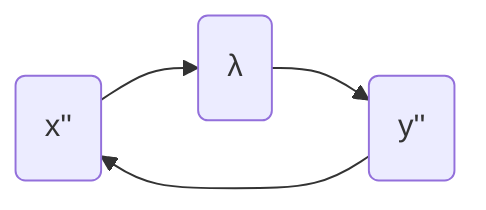

# Dummy Derivatives and Reordering of Equations

Consider a single pendulum in the Cartesian coordinate
```math
\begin{align}
&e_1: x'' - \lambda x = 0 \\
&e_2: y'' - (\lambda y - g) = 0 \\
&e_3: x^2 + y^2 - 1 = 0.
\end{align}
```
Its incidence matrix with respect to the highest differentiated variables
``\{x'', y'', \lambda\}`` is
```math
\begin{pmatrix}
1 & 0 & 1 \\
0 & 1 & 1 \\
0 & 0 & 0
\end{pmatrix}
```
We can obtain a structurally non-singular incidence matrix if we were to
differentiate the last equation two times and get:
```math
\begin{pmatrix}
1 & 0 & 1 \\
0 & 1 & 1 \\
1 & 1 & 0
\end{pmatrix}
```
The perfect matching ``m`` can be ``1 \mapsto 1, 2 \mapsto 3, 3 \mapsto 2``.
According to the perfect matching, we need to interchange the second and the
third row of the incidence matrix to move all nonzero entries to the diagonal.
```math
\begin{pmatrix}
1 & 0 & 1 \\
1 & 1 & 0 \\
0 & 1 & 1
\end{pmatrix}
```
The matching also informs us that we can attempt to solve the highest order
differentiated variables by the assignment
```math
\begin{align}
&e_1: \lambda \mapsto x'' \\
&e_3: x'' \mapsto y'' \\
&e_2: y'' \mapsto \lambda
\end{align}
```
Hence, we have the following dependency graph

Since all the variables are in one strongly connected component, unfortunately,
we cannot break the nonlinear system into smaller subsystems. Let's implement
the differentiated system and solve it numerically.
```@example l8
using ModelingToolkit, OrdinaryDiffEq, Plots, LinearAlgebra
using ModelingToolkit: t_nounits as t, D_nounits as D

function pend_manual(out, u, g, t)
    ẋ, x, ẏ, y, λ = u
    ẍ = out[1] = λ * x
    out[2] = ẋ
    ÿ = out[3] = λ * y - g
    out[4] = ẏ
    # x^2 + y^2 - 1
    # x' x + y' y
    # x'' x + x'^2 + y'' y + y'^2
    out[5] = ẍ*x + ẋ^2 + ÿ*y + ẏ^2
end
fun = ODEFunction(pend_manual, mass_matrix = Diagonal([1, 1, 1, 1, 0]))
prob = ODEProblem(fun, [0, 1, 0, 0, 0.0], (0, 500.0), 1)
sol = solve(prob, Rodas5P())
plot(sol.t, (@. sol[2, :]^2 + sol[4, :]^2), lab = "d0")
```

```@example l8
plot(sol.t, (@. sol[1, :] * sol[2, :] + sol[3, :] * sol[4, :]), lab = "d1")
```
Note that the original constraints are not satisfied and, even worse, the
residual drifts over time. Let's plot the pendulum in the Cartesian coordinate
over time.
```@example l8
plot(sol, idxs = (2, 4), lab = "pendulum", aspect_ratio = 1)
```
The drift causes the system to be completely unphysical.

The issue stems from the fact that we are not explicitly enforcing length and
momentum constraints in the differentiated DAE system. However, if we were to
enforce the equations simultaneously
```math
\begin{align}
&e_3: x^2 + y^2 - 1 &= 0 \\
&e'_3: x' x + y' y &= 0 \\
&e''_3: x'' x + x'^2 + y'' y + y'^2 &= 0
\end{align}
```
We will get an under-determined system that is not numerically integrable.
However, we only need to balance the number of highest order differentiated
variables with the number of equations. We can demote highest order
differentiated variables to algebraic variables to increase the number of
highest order differentiated variables by ``1``. Also, since our objective it to
increase the number of highest order differentiated variables by the number of
differentiated equations introduced during index reduction, we can just focus on
the incidence matrix ``\mathfrak{I}(F_d, \{z_i\})``, where ``F_d`` denotes
differentiated equations. For the pendulum system, we have
```math
\mathfrak{I}(e''_3, \{x'', y'', \lambda\}) = \begin{pmatrix}
1 & 1 & 0
\end{pmatrix}.
```
Furthermore, we want the newly introduced algebraic variables to be solvable. By
analyzing the incidence matrix, we can conclude that we can pick either ``x''``
or ``y''``. Let's arbitrarily pick ``x''``, we have
```math
\mathfrak{I}(e''_3, \{x''\}) = \begin{pmatrix}
1
\end{pmatrix}
```
which is structurally nonsingular. After demoteing ``x''`` to an algebraic
variable, the remaining highest order differentiated variable associated with
``x`` is ``x'``. Thus, we need to pick a variable in
```math
\mathfrak{I}(e'_3, \{x'\}) = \begin{pmatrix}
1
\end{pmatrix}
```
so that the incidence matrix is structurally nonsingular. Trivially, we can just
pick ``x'``. From the above process, we can demote ``x''\in \{u'_i\}`` and
``x'\in \{u'_i\}`` to algebraic variables ``x_{dd}\in\{u_i\}`` and
``x_d\in\{u_i\}``. We get the system
```math
\begin{align}
&e_1: x_{dd} - \lambda x = 0 \\
&e_2: y'' - (\lambda y - g) = 0 \\
&e_3: x^2 + y^2 - 1 = 0 \\
&e'_3: x_d x + y' y = 0 \\
&e''_3: x_{dd} x + x_{d}^2 + y'' y + y'^2 = 0,
\end{align}
```
with the corresponding incidence matrix
```math
\mathfrak{I}(F, \{x_{dd}, x_{d}, x, y'', \lambda\}) = \begin{pmatrix}
1 & 0 & 1 & 0 & 1 \\
0 & 0 & 0 & 1 & 1 \\
0 & 0 & 1 & 0 & 0 \\
0 & 1 & 1 & 0 & 0 \\
1 & 1 & 1 & 1 & 0
\end{pmatrix}
```
A perfect matching ``m`` for this system can be ``1\mapsto 5, 2\mapsto 4,
3\mapsto 3, 4\mapsto 2, 5\mapsto 1``, i.e. we can reverse all rows to move all
nonzeros to the diagonal
```math
\begin{pmatrix}
1 & 1 & 1 & 0 & 0 \\
0 & 1 & 1 & 0 & 0 \\
0 & 0 & 1 & 0 & 0 \\
0 & 0 & 0 & 1 & 1 \\
1 & 0 & 1 & 0 & 1
\end{pmatrix}.
```
Note that if we reorder the variables to ``\{x\}, \{x_{d}\}, \{y'', \lambda, x_{dd}\}``
according to the matching, the equation order should be ``\{e_3, e'_3, e_2, e_1,
e''_3\}`` the incidence matrix is then
```math
\begin{pmatrix}
    1 & 0 & 0 & 0 & 0 \\
    1 & 1 & 0 & 0 & 0 \\
    0 & 0 & 1 & 1 & 0 \\
    1 & 0 & 0 & 1 & 1 \\
    1 & 1 & 0 & 0 & 1
\end{pmatrix}.
```
The reordered original system is then
```math
\begin{align}
&e_3: x^2 + y^2 - 1 = 0 \\
&e'_3: x_d x + y' y = 0 \\
&e_2: y'' - (\lambda y - g) = 0 \\
&e_1: x_{dd} - \lambda x = 0 \\
&e''_3: x_{dd} x + x_{d}^2 + y'' y + y'^2 = 0,
\end{align}
```
and applying the symbolic solving, we have
```math
\begin{align}
&e_3: x^2 + y^2 - 1 = 0 \\
&e'_3: x_d := -\frac{y' y}{x} \\
&e_2: y'' = \lambda y - g\\
&e_1: x_{dd} := \lambda x \\
&e''_3: x_{dd} x + x_{d}^2 + y'' y + y'^2 = 0,
\end{align}.
```
The above system is still second order, we can lower its order to one if we
introduce a variable ``y' = v``, i.e.
```math
\begin{align}
&e_0: y' = v \\
&e_3: x^2 + y^2 - 1 = 0 \\
&e'_3: x_d = -\frac{v y}{x} \\
&e_2: v' = \lambda y - g\\
&e_1: x_{dd} = \lambda x \\
&e''_3: x_{dd} x + x_{d}^2 + v' y + v^2 = 0,
\end{align}
```
Note that ``v'`` appears nonlinearly in ``e''_3``, so it is impossible to
implement the above system in the mass matrix formulation ``Mu' = f(u, p, t)``.
However, we can substitute ``e_2`` to ``e''_3`` to alleviate this problem. Let's
implement this simplified system and solve it using a numerical solver.
```@example l8
function pend_manual_2(out, u, g, t)
    y, x, v, λ = u
    out[1] = v
    out[2] = x^2 + y^2 - 1
    x_d = -v*y/x
    v̇ = out[3] = λ * y - g
    x_dd = λ * x
    out[4] = x_dd * x + x_d^2 + v̇ * y + v^2
end
fun = ODEFunction(pend_manual_2, mass_matrix = Diagonal([1, 0, 1, 0]))
prob = ODEProblem(fun, [0, 1, 0, 0.0], (0, 500.0), 1)
sol = solve(prob, Rodas5P())
plot(sol.t, (@. sol[1, :]^2 + sol[2, :]^2), lab = "d0", ylims = (0, 2))
```
```@example l8
plot(sol.t, (@. sol[2, :] * (-sol[3, :] * sol[1, :] / sol[2, :]) + sol[1, :] * sol[3, :]), lab = "d1", ylims = (-1, 1))
```
```@example l8
plot(sol, idxs = (2, 1), lab = "pendulum", aspect_ratio = 1)
```
Note that this formulation solves the drift problem. However, this time, the
numerical solver terminates early at ``x = 0``. The root problem is that the
true symbolic Jacobian is
```math
\mathfrak{J}(e''_3, \{x'', y'', \lambda\}) = \begin{pmatrix}
x & y & 0
\end{pmatrix},
```
and when ``x=0``, the sub-matrix that we selected will become numerically
singular. Even if we initially pick ``y``, we would run into a similar problem
when ``y=0``. Therefore, a globally valid state selection does not exist in this
system. We can implement the same system in ModelingToolkit and see the same
behavior.
```@example l8
@parameters g
@variables x(t) y(t) [state_priority = 10] λ(t)

eqs = [
       D(D(x)) ~ λ * x
       D(D(y)) ~ λ * y - g
       x^2 + y^2 ~ 1
      ]
@named pend = ODESystem(eqs,t)
pend = complete(pend)
ss = structural_simplify(pend)
prob_ir = ODEProblem(ss, [ModelingToolkit.missing_variable_defaults(ss); x => 1], (0.0, 25.0), [g => 1])
sol = solve(prob_ir, Rodas5P())
plot(sol, idxs = (x, y), lab = "pendulum", aspect_ratio = 1)
```

To have a globally valid state selection, we must pick the polar coordinate, and
the system is then
```math
\begin{align}
&e_1: x'' - \lambda x = 0 \\
&e_2: y'' - (\lambda y - g) = 0 \\
&e_3: x = \cos(\theta) \\
&e_3: y = \sin(\theta).
\end{align}
```
To save the hassle of running algorithms by hand, we can just implement the new
system in ModelingToolkit.
```@example l8
@parameters g
@variables x(t) y(t) λ(t) θ(t) [state_priority = 10] T(t) V(t) E(t)
eqs = [
       D(D(x)) ~ λ * x
       D(D(y)) ~ λ * y - g
       x ~ cos(θ)
       y ~ sin(θ)
       T ~ (D(x)^2 + D(y)^2) / 2
       V ~ y * g
       E ~ T + V
      ]
@named pend = ODESystem(eqs,t)
pend = complete(pend)
ss = structural_simplify(pend)
prob_ir = ODEProblem(ss, ModelingToolkit.missing_variable_defaults(ss), (0.0, 25.0), [g => 1])
sol = solve(prob_ir, Rodas5P())
plot(sol, idxs = (x, y), lab = "pendulum", aspect_ratio = 1)
```
The trajectory looks perfect! For another sanity check, let's plot the energy
variation of the system
```@example l8
plot(sol, idxs = [E-sol[E, 1]])
```
Unfortunately, we see that the total energy is slowly increasing. This is
because `Rodas5P` is not symplectic. A relatively straightforward compiler
internal project is to lower second dynamical systems directly to a
`SecondOrderODEProblem` so that users can use symplectic integrators from
ModelingToolkit as well. Finally, we note that a detail description of the
balancing algorithm is available in the original dummy derivative paper
[^Mattsson1993].

[^Mattsson1993]: Mattsson, Sven Erik, and Gustaf Söderlind. "Index reduction in
    differential-algebraic equations using dummy derivatives." SIAM Journal on
    Scientific Computing 14.3 (1993): 677-692.

### Bonus Demo

```@example l8
@parameters g
@variables x1(t) x2(t) y1(t) y2(t) λ1(t) λ2(t) θ1(t) [state_priority = 10] θ2(t) [state_priority = 10]
@variables T(t) V(t) lx2(t) ly2(t)
eqs = [
       D(D(x1)) ~ λ1 * x1 - λ2 * lx2
       D(D(y1)) ~ λ1 * y1 - λ2 * ly2 - g
       x1 ~ cos(θ1)
       y1 ~ sin(θ1)
       D(D(x2)) ~ λ2 * lx2
       D(D(y2)) ~ λ2 * ly2 - g
       lx2 ~ cos(θ2)
       ly2 ~ sin(θ2)
       x2 ~ lx2 + x1
       y2 ~ ly2 + y1
       T ~ (D(x1)^2 + D(y1)^2) / 2 + (D(x2)^2 + D(y2)^2) / 2
       V ~ y1 * g + y2 * g
      ]

@named pend = ODESystem(eqs,t)
pend = complete(pend)
ss = structural_simplify(pend)
prob_ir = ODEProblem(ss,
                     [ModelingToolkit.missing_variable_defaults(ss); θ2=>1.4],
                     (0.0, 25.0), [g => 1])
sol = solve(prob_ir, Rodas5P(), reltol=1e-7, abstol=1e-9)
plot(sol, idxs = (x1, y1))
plot!(sol, idxs = (x2, y2), xlab = "x", ylab = "y", aspect_ratio=1, dpi=400)
```

```@example l8
plot(sol, idxs = [T+V-sol[T+V, 1]])
```


Plotting code:
```julia
nframes = ceil(Int, sol.t[end]*20)
ts = range(0, sol.t[end], length=nframes)
fps = 20
loop_pend = let (x1s, y1s, x2s, y2s) = [Float64[] for _ in 1:4]
    @time @animate for t in ts
        @show t
        nnn = sol(t, idxs=[x1, y1, x2, y2])
        push!(x1s, nnn[1])
        push!(y1s, nnn[2])
        push!(x2s, nnn[3])
        push!(y2s, nnn[4])
        x1s = x1s[max(1, end-100):end]
        y1s = y1s[max(1, end-100):end]
        x2s = x2s[max(1, end-100):end]
        y2s = y2s[max(1, end-100):end]
        n = length(x1s)
        plot([0, x1s[end]], [0, y1s[end]], linewidth = 3, color=:black)
        plot!([x1s[end], x2s[end]], [y1s[end], y2s[end]], linewidth = 3, color=:black)
        linewidth = 10
        seriesalpha = 1
        if n != 1
            linewidth = range(0, linewidth, length = n)
            seriesalpha = range(0, seriesalpha, length = n)
        end
        plot!(x1s, y1s; linewidth, seriesalpha)
        linewidth = 10
        if n != 1
            linewidth = range(0, linewidth, length = n)
        end
        plot!(x2s, y2s; linewidth, seriesalpha,
              dpi = 400, aspect_ratio = 1,
              xlims = (-2.3, 2.3), ylims = (-2.3, 2.3),
              axis=false, leg = false, grid=false)
    end every 5
end
@time mp4(loop_pend, "double_pendulum.mp4"; fps)
```

### Details on Reordering

!!! definition "Induced Directed Graphs"

    The induced directed graph ``G = (V, E_v)`` from the destination vertices of
    a bipartite graph ``(U, V, E)`` and a perfect matching ``M`` is defined as
    ```math
    E_v = \{(i, j): (M(i), j) \in E\}.
    ```
    Similarly, the induced directed graph ``G = (V, E_u)`` from the source
    vertices is defined as
    ```math
    E_u = \{(i, j): (i, M^{-1}(j)) \in E\}.
    ```

!!! definition "Strongly Connected Component"

    A strongly connected component ``c\subseteq E`` of a directed graph ``G = (V,
    E)`` is a maximum cardinality set of vertices such that any pair ``i \in c,
    j \in c``, there exists a path ``i \rightsquigarrow j`` in ``G``.

!!! note "Strongly Connected Components Uniqueness Theorem"

    The strongly connected components are unique for induced directed graphs
    from bipartite graphs with a perfect matching.

    #### Proof:
    See [^DulmageMendelsohn1958].

[^DulmageMendelsohn1958]: Dulmage, Andrew L., and Nathan S. Mendelsohn.
    "Coverings of bipartite graphs." Canadian Journal of Mathematics 10 (1958):
    517-534.


#### Example

Consider a nonlinear system represented by
```math
\begin{align}
f_1(v_1, v_3) &= 0 \\
f_2(v_1, v_3) &= 0 \\
f_3(v_1, v_2) &= 0
\end{align}
```
The incidence matrix is
```math
\begin{pmatrix}
1 & 0 & 1 \\
1 & 0 & 1 \\
1 & 1 & 0
\end{pmatrix}
```
where a perfect matching ``m`` is then defined as
```math
1 \mapsto 1, 2 \mapsto 3, 3 \mapsto 2.
```
The permuted matrix is then
```math
\begin{pmatrix}
1 & 0 & 1 \\
1 & 1 & 0 \\
1 & 0 & 1
\end{pmatrix}.
```
The matching can be interpreted as a solvability assignment, i.e.
```math
\begin{align}
v_1 &= \hat{f}_1(v_3) \\
v_2 &= \hat{f}_3(v_1) \\
v_3 &= \hat{f}_2(v_2)
\end{align}
```
Even if all ``\{\hat{f}_i\}`` are symbolically solvable, the above assignment
will not work because the interdependence of variables. The strongly connected
component definition captures this idea well. Variables in a non-trivial
strongly connected component are the largest set of variables that are
interdependent. The strongly connected components of the above system are
``\{\{1, 3\}, \{2\}\}``. Thus, by the previous matching, we should reorder the
equations as ``e_1, e_2, e_3`` and variables as ``v_1, v_3, v_2`` to isolate the
interdependent part. The resulting system is then
```math
\begin{pmatrix}
1 & 1 & 0 \\
1 & 1 & 0 \\
1 & 0 & 1
\end{pmatrix}.
```
Note that resulting matrix is block lower triangular and this is not a
coincidence. We can always reorder the system to be block lower triangular
granted by the following theorem.

!!! definition "Condensation Graph"

    A condensation graph ``G_c = (V_c, E_c)`` of a directed graph
    ``G = (V, E)`` is a directed graph that has vertices
    ```math
    V_c = \{\text{strongly connected components of } G\},
    ```
    and edges
    ```math
    E_c = \{(i, j): \exists i_e \in i, j_e \in j, i \ne j \land (i_e, j_e)
    \in E\}.
    ```

!!! note "Condensation Graphs are Acyclic Theorem"

    The condensation graph ``G_c = (V_c, E_c)`` induced from the directed graph
    ``G = (V, E)`` is acyclic.

    #### Proof:
    Suppose ``G_c`` is cyclic with a cycle consisting of vertices ``s = \{v_1,
    v_2, ...\} \subseteq V_c``. Then, any original vertices in ``v_i`` has a
    path to any vertices in ``v_j`` for all ``i, j``. Thus, ``G_c`` must have
    only one vertex. By the definition of a condensation graph, ``G_c`` must has
    no edges, and therefore, no cycles.

Since the condensation graph has no cycles, we can topologically sort strongly
connected components so that the resulting system is always block lower
triangular. Further, each block on the diagonal must be square, because the
perfect matching will map all variables in each strongly connected components to
distinct equations.

## Demo

```julia
using ModelingToolkit, OrdinaryDiffEq, LinearAlgebra
import ModelingToolkitStandardLibrary.Hydraulic.IsothermalCompressible as IC
import ModelingToolkitStandardLibrary.Blocks as B
import ModelingToolkitStandardLibrary.Mechanical.Translational as T
using ModelingToolkit: t_nounits as t, D_nounits as D

function System(use_input, f; name)

    pars = @parameters begin
        p_s = 200e5
        p_r = 5e5

        A_1 = 360e-4
        A_2 = 360e-4

        p_1 = 45e5
        p_2 = 45e5

        l_1 = 0.01
        l_2 = 0.05
        m_f = 250
        g = 0

        d = 100e-3

        Cd = 0.01

        m_piston = 880
    end

    vars = @variables begin
        ddx(t) = 0
    end

    systems = @named begin
        src = IC.FixedPressure(; p = p_s)
        valve = IC.SpoolValve2Way(; p_s_int = p_s, p_a_int = p_1, p_b_int = p_2,
            p_r_int = p_r, g, m = m_f, x_int = 0, d, Cd)
        piston = IC.Actuator(5;
            p_a_int = p_1,
            p_b_int = p_2,
            area_a = A_1,
            area_b = A_2,
            length_a_int = l_1,
            length_b_int = l_2,
            m = m_piston,
            g = 0,
            x_int = 0,
            minimum_volume_a = A_1 * 1e-3,
            minimum_volume_b = A_2 * 1e-3,
            damping_volume_a = A_1 * 5e-3,
            damping_volume_b = A_2 * 5e-3)
        body = T.Mass(; m = 1500)
        pipe = IC.Tube(5; p_int = p_2, area = A_2, length = 2.0)
        snk = IC.FixedPressure(; p = p_r)
        pos = T.Position()

        m1 = IC.FlowDivider(; p_int = p_2, n = 3)
        m2 = IC.FlowDivider(; p_int = p_2, n = 3)

        fluid = IC.HydraulicFluid()
    end

    if use_input
        @named input = B.SampledData(Float64)
    else
        @named input = B.TimeVaryingFunction(f)
    end

    push!(systems, input)

    eqs = [connect(input.output, pos.s)
        connect(valve.flange, pos.flange)
        connect(valve.port_a, piston.port_a)
        connect(piston.flange, body.flange)
        connect(piston.port_b, m1.port_a)
        connect(m1.port_b, pipe.port_b)
        connect(pipe.port_a, m2.port_b)
        connect(m2.port_a, valve.port_b)
        connect(src.port, valve.port_s)
        connect(snk.port, valve.port_r)
        connect(fluid, src.port, snk.port)
        D(body.v) ~ ddx]

    ODESystem(eqs, t, vars, pars; name, systems)
end

@named system = System(true, nothing)

# sys = structural_simplify(system)
using ModelingToolkit.StructuralTransformations, ModelingToolkit.BipartiteGraphs,
    Graphs
ts = TearingState(ModelingToolkit.expand_connections(system))
m = BipartiteGraphs.maximal_matching(ts.structure.graph, _->true, x->ts.structure.var_to_diff[x] === nothing);
count(x->x isa Int, m)
count(x->x===nothing, ts.structure.eq_to_diff)
ModelingToolkit.pantelides!(ts)
m = BipartiteGraphs.maximal_matching(ts.structure.graph, x->ts.structure.eq_to_diff[x]===nothing, x->ts.structure.var_to_diff[x] === nothing);
count(x->x isa Int, m)
count(x->x===nothing, ts.structure.eq_to_diff)
M = incidence_matrix(ts.structure.graph)
A = M[Int[m[i] for i in eachindex(m) if m[i] isa Int], Int[i for i in eachindex(m) if m[i] isa Int]]
all(isequal(1), diag(A))
g = BipartiteGraphs.DiCMOBiGraph{true}(complete(ts.structure.graph), complete(m));
scc = strongly_connected_components(g);
M[Int[m[i] for i in reduce(vcat, scc) if m[i] isa Int], Int[i for i in reduce(vcat, scc) if m[i] isa Int]]
for c in scc
    length(c) > 1 || continue
    B = M[Int[m[i] for i in c if m[i] isa Int], Int[i for i in c if m[i] isa Int]]
    display(B)
end
```

```julia
using ModelingToolkit, OrdinaryDiffEq, Plots
using ModelingToolkit: t_nounits as t, D_nounits as D

@parameters g
@variables x1(t) x2(t) y1(t) y2(t) λ1(t) λ2(t) θ1(t) [state_priority = 10] θ2(t) [state_priority = 10]
eqs = [
       D(D(x1)) ~ λ1 * x1,
       D(D(y1)) ~ λ1 * y1 - g,
       x1 ~ cos(θ1),
       y1 ~ sin(θ1),
       D(D(x2)) ~ λ2 * x2,
       D(D(y2)) ~ λ2 * y2 - g,
       x2 ~ x1 + cos(θ2),
       y2 ~ y1 + sin(θ2),
      ]

@named pend = ODESystem(eqs,t)
pend = complete(pend)
ss = structural_simplify(pend)
prob_ir = ODEProblem(ss,
    [
     ModelingToolkit.missing_variable_defaults(ss);
     θ1 => 0
     θ2 => 0
     D(θ1) => 0.0
     D(θ2) => 0.0
     λ1 => 0
     λ2 => 0
    ],
    (0.0, 25.0), [g => 1])
sol = solve(prob_ir, Rodas5P())
plot(sol, idxs = (x1, y1))
plot!(sol, idxs = (x2, y2), xlab = "x", ylab = "y", aspect_ratio=1, dpi=400)
nframes = ceil(Int, sol.t[end]*20)
ts = range(0, sol.t[end], length=nframes)
fps = 20
let (x1s, y1s, x2s, y2s) = [Float64[] for _ in 1:4]
    loop_pend = @time @animate for t in ts
        nnn = sol(t, idxs=[x1, y1, x2, y2])
        push!(x1s, nnn[1])
        push!(y1s, nnn[2])
        push!(x2s, nnn[3])
        push!(y2s, nnn[4])
        x1s = x1s[max(1, end-100):end]
        y1s = y1s[max(1, end-100):end]
        x2s = x2s[max(1, end-100):end]
        y2s = y2s[max(1, end-100):end]
        n = length(x1s)
        plot([0, x1s[end]], [0, y1s[end]], linewidth = 3, color=:black)
        plot!([x1s[end], x2s[end]], [y1s[end], y2s[end]], linewidth = 3, color=:black)
        linewidth = 10
        seriesalpha = 1
        if n != 1
            linewidth = range(0, linewidth, length = n)
            seriesalpha = range(0, seriesalpha, length = n)
        end
        plot!(x1s, y1s; linewidth, seriesalpha)
        linewidth = 10
        if n != 1
            linewidth = range(0, linewidth, length = n)
        end
        plot!(x2s, y2s; linewidth, seriesalpha,
              dpi = 400, aspect_ratio = 1,
              xlims = (-2.3, 2.3), ylims = (-2.3, 1),
              axis=false, leg = false, grid=false)
    end every 5
    @time mp4(loop_pend, "double_pendulum.mp4"; fps)
end
```
